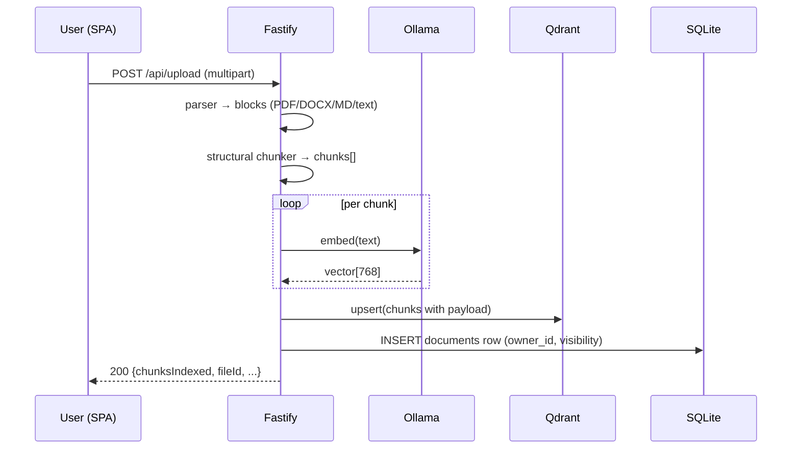
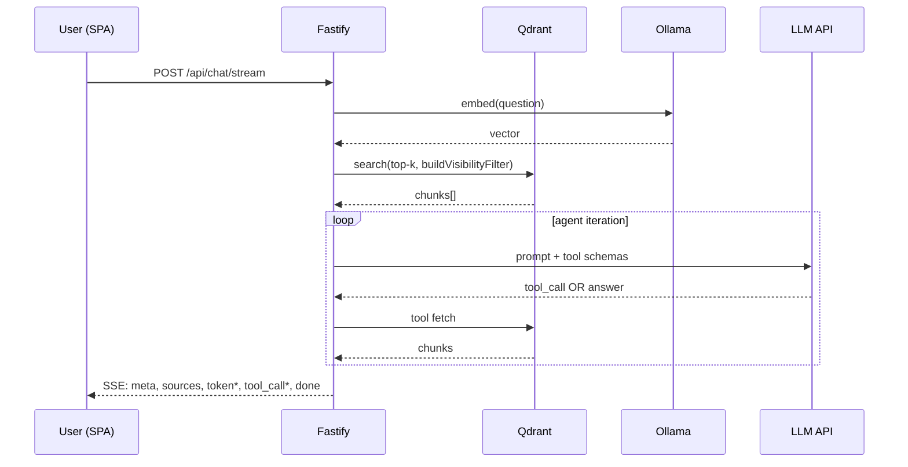

# 📄 DocKhoj

> **Khoj** (کھوج) — Hindi/Urdu for "search."

DocKhoj is a self-hosted document index and RAG answer engine. Upload your PDFs, DOCX, Markdown, and text files; ask natural-language questions; get cited answers grounded in your own files. Runs entirely on your machine — embeddings via local Ollama, vector storage in Qdrant, chat completions against any OpenAI-compatible API.

```text
┌──────────┐  HTTP + cookie   ┌────────────────┐  gRPC :6334   ┌─────────┐
│  Browser │ ───────────────▶ │ Fastify server │ ────────────▶ │ Qdrant  │
│   SPA    │ ◀───── SSE ───── │   (Node 20)    │               └─────────┘
└──────────┘                  │                │  HTTP :11434  ┌─────────┐
                              │                │ ────────────▶ │ Ollama  │
                              │                │               └─────────┘
                              │                │  HTTPS        ┌──────────┐
                              │                │ ────────────▶ │ OpenAI-  │
                              │                │               │ compat   │
                              │                │               │ API      │
                              │                │               └──────────┘
                              │                │
                              │                │  file         ┌──────────┐
                              │                │ ────────────▶ │ SQLite   │
                              │                │  (WAL + FK)   │  (users, │
                              │                │               │  sessions│
                              │                │               │  docs,   │
                              │                │               │  msgs)   │
                              │                │               └──────────┘
                              └────────────────┘
                              bind mounts under ~/.dockhoj/
```

---

## Quick start

### Option A — one-liner (no clone needed)

```bash
curl -sSL https://raw.githubusercontent.com/TahaNKhan/DocKhoj/main/scripts/setup.sh | bash
```

The script checks for Docker, clones the repo into `~/dockhoj`, writes `.env`, prompts for an `OPENAI_API_KEY`, and brings the stack up. Once it prints **App is healthy**, open <http://localhost:3001/register> and create the first user (that account becomes the admin).

### Option B — clone + manual setup

```bash
git clone https://github.com/TahaNKhan/DocKhoj.git
cd DocKhoj
cp .env.example .env
# Edit .env: set OPENAI_API_KEY (everything else has defaults)
./restart.sh                              # full first-time build (~5 min, pulls the embedding model)
open http://localhost:3001                 # → /register → first user = admin
```

### Verify

```bash
curl http://localhost:3001/api/health
# {"status":"ok","ollama":true}
```

---

## Features

- **Multi-format ingestion** — PDFs (page-aware), DOCX (paragraph + heading style), Markdown (GFM), plain text. Drag-and-drop upload with per-file status.
- **Structurally-aware chunker** — splits at heading / paragraph / code-fence / list-item boundaries; never breaks a code block or a single list item; preserves `headingPath` + `pageNumber` as metadata for citations.
- **Token-aware, sentence-aligned overlap** — chunk sizes in `gpt-tokenizer` tokens; overlap selected via sentence boundaries (handles abbreviations, decimals, full-width punctuation).
- **Vector search with payload filters** — `fileName`, `fileType`, plus the scope of "chunks visible to this user".
- **Three expand modes** — `none` (top-k only), `siblings` (±2 chunks around each hit), `sections` (whole heading), or `auto` (LLM agent loop with retrieval tools).
- **Agentic RAG** — `expand=auto` gives the LLM four retrieval tools (`get_neighbor_chunks`, `get_section_chunks`, `get_chunk`, `get_document`) inside a bounded loop (default 10 iterations, 10K-token per-iteration tool-result cap).
- **Streaming SSE chat** — events: `meta`, `sources`, `token*`, `tool_call*`, `tool_result*`, `done`, `title`.
- **Persistent conversations** — SQLite-backed sessions and messages; survives container restarts; tool calls persisted per assistant message.
- **Per-user ownership + invites** — first user becomes admin; subsequent signups require an admin-issued invite. Documents are scoped: a user can only see / search / chat against their own files plus legacy shared files (`owner_id = NULL`).
- **Markdown rendering in chat bubbles** — sanitized via DOMPurify; XSS-safe on assistant output.
- **Path-traversal-safe download** — `GET /api/download/:filename` rejects `..` and outside-`$DOCKHOJ_HOME` paths.
- **Bounded-parallel embedding** — `p-limit` on concurrent Ollama calls; exponential backoff on transient errors.
- **Graceful shutdown** — SIGTERM/SIGINT drains in-flight requests before exit.

---

## How it works

### Upload



### Chat (`expand=auto`)



### Visibility

Per-user scope is enforced uniformly on every Qdrant call: `buildVisibilityFilter(viewerId)` produces `{ should: [visibility=public, ownerId=self] }`. The four agent-loop tools apply the same filter — the LLM cannot reason its way around it; `get_document(<foreign fileId>)` returns `{ found: false }`.

---

## Configuration

All config is via `.env` (loaded by `docker compose`). Defaults are sensible for a single-host install.

| Variable | Default | Description |
|---|---|---|
| `OPENAI_API_KEY` | **required** | Chat completions API key (OpenAI, Anthropic-via-gateway, MiniMax, etc.) |
| `OPENAI_BASE_URL` | `https://api.openai.com/v1` | Any OpenAI-compatible endpoint |
| `LLM_MODEL` | `gpt-4o` | Chat model name |
| `LLM_CONTEXT_SIZE` | _probed_ | Override only if your provider doesn't expose `/v1/models` and the model isn't in the built-in fallback table |
| `OLLAMA_BASE_URL` | `http://ollama:11434` | Embedding server (Docker network) |
| `EMBEDDING_MODEL` | `nomic-embed-text` | Any Ollama embedding model — set `VECTOR_SIZE` to match its output dimension |
| `QDRANT_URL` | `http://qdrant:6333` | Vector DB |
| `QDRANT_COLLECTION` | `documents` | Collection name |
| `VECTOR_SIZE` | `768` | Must match the embedding model |
| `PORT` | `3001` | App port |
| `SQLITE_PATH` | `/app/data/conversations.db` | Inside the container; bind-mounted to `$DOCKHOJ_HOME/db` |
| `CHUNK_MAX_TOKENS` | `512` | Per-chunk token budget (cl100k_base) |
| `CHUNK_OVERLAP_TOKENS` | `64` | Sentence-aligned overlap |
| `CHUNK_MIN_TOKENS` | `32` | Trailing chunks smaller than this merge with the previous |
| `CHUNK_SEMANTIC_SPLIT` | `true` | Re-split oversized chunks at low-cosine topic boundaries (extra embed calls) |
| `EMBEDDING_CONCURRENCY` | `4` | Max parallel Ollama calls |
| `CHAT_HISTORY_MAX_TURNS` | `20` | Past turns included in the prompt |
| `MAX_AGENT_ITERATIONS` | `10` | LLM-call cap inside the agent loop |
| `TOOL_RESULT_TOKEN_CAP` | `10000` | Per-iteration token cap on tool-result payloads |
| `LOG_CHUNK_PREVIEW_CHARS` | `200` | Truncate chunk text in logs |

---

## API surface

All routes under `/api/*` require authentication (see Auth below) **except** `/api/health` and `/api/auth/*`.

| Method | Path | Purpose |
|---|---|---|
| `GET` | `/api/health` | Liveness probe — Ollama + Qdrant reachable? |
| `GET` | `/api/status` | Per-user chunk / document counts (TopBar pill) |
| `POST` | `/api/auth/register` | First user only; 403 after that |
| `POST` | `/api/auth/login` | Sets `dockhoj_sid` cookie |
| `POST` | `/api/auth/logout` | Clears cookie + deletes server session row |
| `GET` | `/api/auth/me` | Current user (or 401) |
| `GET` | `/api/auth/status` | `{firstUserAvailable: bool}` |
| `POST` | `/api/auth/invite/accept` | Redeem an invite token |
| `POST` | `/api/admin/invites` | Create invite (admin) |
| `GET` | `/api/admin/invites` | List outstanding invites (admin) |
| `DELETE` | `/api/admin/invites/:id` | Revoke invite (admin) |
| `GET` | `/api/admin/users` | List users (admin) |
| `DELETE` | `/api/admin/users/:id` | Delete user + their docs + sessions (admin) |
| `POST` | `/api/admin/users/:id/password` | Reset user password (admin) |
| `GET` | `/api/documents` | User's documents |
| `DELETE` | `/api/documents/:fileId` | Delete (own + shared only; 404 otherwise) |
| `GET` | `/api/download/:filename` | Serve file (visibility-scoped, 404 if not yours) |
| `POST` | `/api/upload` | Multipart upload; per-file events on `/api/upload/progress` SSE |
| `GET` | `/api/search?q=…&expand=…` | Vector search |
| `GET` | `/api/search/rag?q=…` | Search + LLM answer |
| `POST` | `/api/chat` | Non-streaming RAG chat |
| `POST` | `/api/chat/stream` | Streaming SSE chat (`expand` defaults to `auto`) |
| `GET` | `/api/sessions` | List the user's conversations |
| `POST` | `/api/sessions` | Create conversation |
| `GET` | `/api/sessions/:id` | Fetch one |
| `PATCH` | `/api/sessions/:id` | Rename (locks title against future LLM overwrite) |
| `DELETE` | `/api/sessions/:id` | Delete + cascade messages |
| `GET` | `/api/sessions/:id/messages` | Fetch message history |

Page routes (`/chat`, `/upload`, `/login`, `/register`, `/admin/*`) fall through to the SPA's `index.html`; the SPA's `RouteGuard` redirects unauthenticated users to `/login?next=<path>`.

---

## Authentication

DocKhoj is single-tenant and per-user.

- **First visit** to a fresh volume → `/register` (the very first account becomes the admin; subsequent signups require an invite from an admin).
- **Cookie:** `dockhoj_sid` — HttpOnly, SameSite=Lax. Secure flag flips on with `NODE_ENV=production`.
- **Sessions:** Server-side rows in SQLite; rolling 30-day expiry on every authenticated request; logout deletes the row.
- **Passwords:** `crypto.scrypt` (Node stdlib, no native build). Format `scrypt$N$r$p$salt$derived` so a future argon2id swap is a single-file verify-path change. Minimum 12 chars + at least one non-alphanumeric.
- **Visibility:** every Qdrant call carries `buildVisibilityFilter(request.user.id)`. Documents are scoped per `owner_id`; legacy pre-auth uploads have `owner_id = NULL` and are visible to every logged-in user (deleting a shared file is open to any logged-in user by design).

> ⚠️ **Serve over HTTPS in production.** The cookie's `Secure` flag is `off` in development. Front the app with a reverse proxy that handles TLS (Caddy, nginx, Traefik) — DocKhoj does not terminate TLS itself.

---

## Development

### NPM scripts

| Script | What it does |
|---|---|
| `npm run dev` | Server + SPA together (concurrently) |
| `npm run dev:server` | Server only, `tsx` watch |
| `npm run dev:web` | SPA only, Vite dev server |
| `npm run build` | Server (`tsc` + asset copy) + SPA (`vite` single-file build) |
| `npm start` | Run the compiled server (`dist/index.js`) |
| `npm test` | All vitest projects |
| `npm run coverage` | `vitest run --coverage`; thresholds fail the run |
| `npm run reset-admin-account` | Reset a locked-out admin's username + password (DB-side, no auth bypass) |
| `./restart.sh` | Default: rebuild + recreate only the `app` container |
| `./restart.sh --full` | Tear everything down, rebuild from scratch with `--no-cache` |

### Project layout

```text
src/
  parser/             Structured parsers (Markdown AST, PDF page-aware, DOCX, text)
  services/
    auth.ts                Session middleware (FR-20..25)
    auth-session-store.ts  AuthSessionStore (rolling expiry)
    user-store.ts          UserStore (scrypt hash, role)
    invite-store.ts        InviteStore (random token + SHA-256 hash)
    password.ts            scrypt hash + verify
    parser.ts              Dispatcher → ParsedDocument
    embed.ts               Ollama embeddings (parallel + retry)
    qdrant.ts              Collection init, payload indexes, buildVisibilityFilter,
                           expandHits, deleteByFilePath
    openai-api-wrapper.ts  Chat completions + tool-call streaming
    conversations.ts       ConversationStore (titles, toolCalls)
    stream-chat.ts         Non-agentic chat orchestrator
    agent-tools.ts         Four LLM-callable retrieval tools
    agent-loop.ts          Bounded agent loop
    document-store.ts      Documents table CRUD (owner_id, visibility)
  db/                better-sqlite3 singleton + migration runner + SQL files
  routes/
    api-auth.ts       /api/auth/* (register/login/logout/me/status/invite/accept)
    api-admin.ts      /api/admin/* (invites, users, password reset)
    api-health.ts     /api/health
    api-status.ts     /api/status (user-scoped)
    api-sessions.ts   /api/sessions[/:id[/messages]]
    api-documents.ts  /api/documents[/:fileId], /api/download/:filename
    chat.ts           POST /api/chat (non-agentic default)
    chat-stream.ts    POST /api/chat/stream (agent loop when expand=auto)
    upload.ts         POST /api/upload
    upload-progress.ts GET /api/upload/progress (SSE)
    search.ts         /api/search and /api/search/rag
    download.ts       /api/download/:filename (path-traversal-safe)
  server/spa.ts      Static + SPA fallback for non-/api/*
  index.ts           Fastify app + auth + graceful shutdown

web/                 Preact + Vite SPA (single-file build → web/dist/)
  src/components/    Bubble, Composer, DocumentsList, Dropzone, QueueRow,
                     RouteGuard, Sidebar, SourceDrawer, TopBar, UserMenu,
                     AdminUsers, AdminInvites, ...
  src/routes/        Chat, Upload, Login, Register, InviteAccept,
                     AdminUsers, AdminInvites
  tests/             Component tests (happy-dom)

tests/               vitest (node project) — parser, services, routes, db, e2e
```

### Switching embedding models

Change `EMBEDDING_MODEL` in `.env` to any Ollama embedding model (e.g. `bge-m3`, `mxbai-embed-large`). Update `VECTOR_SIZE` to match the model's output dimension — otherwise the Qdrant collection is recreated with the wrong size and existing embeddings are lost. Back up `$DOCKHOJ_HOME/qdrant/` before changing.

### Recovering a lost admin account

If the admin's password is lost (e.g. you ran the E2E test suite, which creates an admin with a generated password), `npm run reset-admin-account` walks you through a credential reset — rename the admin and set a new password, and wipe all their sessions so any cached cookie stops working. **Documents, conversations, and invites are preserved.**

```bash
# Stop the app so it isn't holding the SQLite write lock.
docker compose stop app

# Interactive — lists every admin, you pick one, prompts for new username + password.
npm run reset-admin-account

# Non-interactive (scriptable):
npm run reset-admin-account -- --user alice --new-username alicia --new-password 'correct-horse-battery-staple!'

# Bring the app back up.
docker compose start app
```

DB path resolution (in order): `$SQLITE_PATH` → `$DOCKHOJ_HOME/db/conversations.db` → `~/.dockhoj/db/conversations.db`. Override with `--db <path>`.

### Tests

```bash
npm test            # all projects (node + web)
npm test -- --run tests/services/embed.test.ts   # one file
```

The cross-user retrieval e2e in `tests/e2e/cross-user-retrieval.test.ts` requires `./restart.sh` to be running so the docker-network IP for Qdrant is routable; the suite self-skips (rather than fails) when not.

---

## Persistence

Three host directories under `$DOCKHOJ_HOME` (default `~/.dockhoj/`):

- `$DOCKHOJ_HOME/db` — bind-mounted to `/app/data` in the app container (SQLite `conversations.db` + WAL + SHM)
- `$DOCKHOJ_HOME/qdrant` — bind-mounted to `/qdrant/storage` in the qdrant container
- `$DOCKHOJ_HOME/documents` — uploaded files. Bind-mounted to `/app/documents` in the app container; the app's `UPLOAD_DIR=/app/documents` env points the upload/download routes at the bind-mount target.

The legacy in-repo layout used `./qdrant_data/` and `./documents/` for the latter two. `./restart.sh`'s `migrate_state` block copies both into `$DOCKHOJ_HOME` on first run after upgrading (one-shot, idempotent); the old directories are left in place so the user can `rm -rf` them after verifying the new layout works.

Point `DOCKHOJ_HOME` elsewhere to run multiple stacks on one host, or back the data onto a separate disk:

```bash
DOCKHOJ_HOME=/path/to/backup ./restart.sh
```

The Ollama embedding model is baked into the `dockhoj-ollama` image — no host mount, nothing to back up. On a fresh clone the first `./restart.sh` builds the ollama image (which pulls `nomic-embed-text`, ~274 MB); subsequent runs reuse the image cache.

---

## License

MIT
