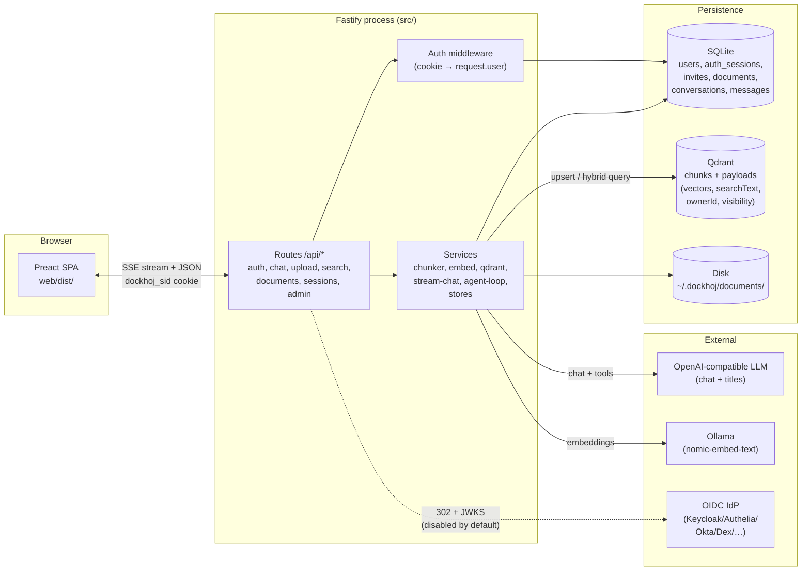
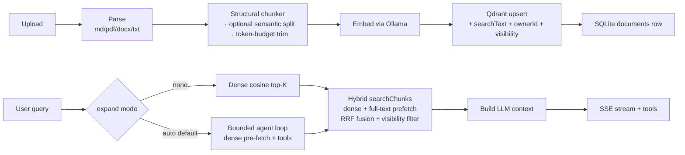

# DocKhoj — Architecture

> **The 30-second model.** DocKhoj is a self-hosted, multi-user RAG
> knowledge base. You upload documents (PDF/MD/DOCX/TXT), they get
> chunked + embedded and stored in Qdrant; a chat UI streams answers
> grounded in your corpus via an OpenAI-compatible LLM, with an
> agentic retrieval loop that can drill into neighboring sections on
> demand. Everything is one Fastify process serving a Preact SPA +
> `/api/*`; persistence is SQLite (users, sessions, documents, chat
> history) + Qdrant (chunk vectors + payloads). Auth is a custom
> cookie-session layer; every `/api/*` route except auth + health is
> gated.

This document is the canonical record of the system's shape and the
cross-cutting "why" behind it. Per-decision rationale lives as
`// why:` comments at the call site in code; this file holds only the
decisions that shape the whole system. It supersedes the per-phase
spec folders that previously lived under `docs/specs/` — those were
working scratchpads, folded in here when each phase shipped.

---

## System overview



Three boundaries matter: the **trust boundary** (the SPA is untrusted;
`/api/*` except `/api/auth/*` and `/api/health` requires a session),
the **retrieval boundary** (every Qdrant read/write threads a
`viewerId` so private chunks never leak across users), and the
**persistence boundary** (SQLite is source of truth for structured
data; Qdrant for vectors + searchable text; disk for raw uploads).

---

## Tech stack

| Layer | Choice | Why |
|---|---|---|
| Server | Node 20 + Fastify + TypeScript (`src/`) | Single process, async, fast. No framework bloat. |
| SPA | Preact 10 + Vite + `wouter-preact` | Preact is ~3 KB vs React's ~45 KB; same API. `vite-plugin-singlefile` inlines the bundle. |
| DB | `better-sqlite3`, WAL mode, `foreign_keys=ON` | Synchronous, fastest, most idiomatic for a single-process self-hosted tool. Rejected `node:sqlite` (experimental) and `sql.js` (WASM). |
| Migrations | Hand-rolled runner (`src/db/migrate.ts` + `migrations/*.sql`, tracked in `_migrations` table) | No migration library; SQL files ordered by number, applied idempotently on boot. |
| Vector store | Qdrant 1.17+ | Native hybrid search (dense + full-text + RRF server-side), payload indexes. |
| Embeddings | Ollama (`nomic-embed-text`, 768-dim) | Local, no API cost for the embed step. |
| Chat LLM | OpenAI-compatible API (OpenAI, MiniMax, any compatible) | `OPENAI_BASE_URL` + `OPENAI_API_KEY`. Defaults to `gpt-4o`. |
| Tokenizer | `gpt-tokenizer` + `cl100k_base` | Token-aware chunking + context caps. |
| Password hashing | Node stdlib `crypto.scrypt` (N=2^14, 16-byte salt) | No native build, no new dep. `scrypt$…` format prefix is a hook for a future argon2id swap (single-file verify-path change). |
| Markdown | `marked` + DOMPurify (rendered server-validated) | LLM output sanitized before `innerHTML`. |
| Logging | `pino` with per-component child loggers | Structured, fast. |

No dependency is added without the ponytail ladder (stdlib → native →
installed dep → new dep). Phases 03, 04, and 05 each shipped with
**zero new dependencies**.

---

## Module layout (`src/`)

```
src/
  index.ts                 # Boot: migrate → init Qdrant → register routes → listen
  server/spa.ts            # SPA fallback: non-/api/* GETs serve web/dist/index.html
  services/
    auth.ts                # onRequest hook: cookie → request.user, gates /api/*
    user-store.ts          # users table CRUD
    auth-session-store.ts  # auth_sessions table (cookie sessions)
    invite-store.ts        # invites table (single-use, SHA-256 hashed)
    password.ts            # scrypt hash/verify
    qdrant.ts              # collection init, payload migrations, hybrid searchChunks
    embed.ts               # Ollama embedding client
    openai-api-wrapper.ts  # chat + streaming-with-tools
    stream-chat.ts         # SSE orchestrator (meta/sources/token/done/title)
    agent-loop.ts          # bounded tool-calling retrieval loop
    agent-tools.ts         # get_neighbor/section/chunk/document tools
    conversations.ts       # conversations + messages tables
    document-store.ts      # documents table (upload metadata)
    title-generator.ts     # async LLM title generation
    parser/                # parser-{markdown,pdf,docx,text}.ts
    chunk (utils/)         # structural → semantic → token-budget chunking
    utils/think-filter.ts  # stateful <think>-tag stripper for SSE tokens
  routes/
    api-auth.ts            # /api/auth/* (register, login, logout, me, status, invite/accept)
    api-admin.ts           # /api/admin/* (invites, users — admin-only)
    api-sessions.ts        # chat session CRUD + messages
    chat.ts, chat-stream.ts
    upload.ts, download.ts, api-documents.ts
    search.ts, api-status.ts, api-health.ts
  db/
    index.ts, migrate.ts, migrations/001..007_*.sql
```

---

## Data model

### SQLite (`conversations.db`, WAL)

| Table | Purpose | Key fields |
|---|---|---|
| `users` | Credentials + role | `id` UUIDv4 PK, `username` UNIQUE, `password_hash`, `role CHECK('admin'\|'user')`, `created_at`, `last_login_at` |
| `auth_sessions` | Server-side cookie sessions | `id` 32-byte URL-safe base64 PK, `user_id` FK CASCADE, `last_seen_at`, `expires_at` |
| `invites` | Single-use signup tokens | `token_hash` SHA-256 UNIQUE (raw token never stored), `created_by` FK, `expires_at`, `used_by` FK |
| `documents` | Upload metadata | `file_id` UUID PK, `file_name`, `file_type`, `bytes`, `uploaded_at`, `chunk_count`, `owner_id` FK SET NULL, `visibility CHECK('public'\|'private')` |
| `conversations` | Chat sessions | `id`, `title`, `title_source CHECK('default'\|'generated'\|'fallback'\|'user')`, `created_at`, `updated_at`, `owner_id` FK CASCADE |
| `messages` | Chat turns | `id`, `conversation_id` FK CASCADE, `role CHECK('user'\|'assistant')`, `content`, `sources` JSON, `tool_calls` JSON, `created_at` |
| `_migrations` | Migration tracking | `id`, `applied_at` |

**FK policy:** sessions/invites cascade on user delete; documents use
`ON DELETE SET NULL` (legacy public files survive user deletion);
conversations cascade.

### Qdrant (`documents` collection)

Each point's payload carries: `chunk` (text), `searchText` (verbatim
copy of `chunk`, indexed as `text` schema for full-text), `filePath`,
`fileType`, `chunkIndex`, `headingPath`, `ownerId` (string; empty
string `''` = shared/public, **never `null`**), `visibility`
(`'public'|'private'`). Payload indexes on `searchText` (text),
`ownerId` (keyword), `visibility` (keyword). An `app_metadata`
collection flags one-shot payload migrations as applied (Phase 04
owner/visibility backfill, Phase 05 searchText backfill).

---

## Authentication & trust boundary

This is the most security-sensitive area and the substrate for any
future SSO/OAuth work (Phase 06+).

- **Cookie sessions, not JWT.** A server-side row in `auth_sessions`
  enables immediate revocation via `DELETE` (admin force-logout,
  password reset, user delete). Every authenticated request is a PK
  lookup — trivial cost — and that buys revocation, which JWT can
  only approximate with a separate revocation list.
- **Cookie attributes:** name `dockhoj_sid`, `HttpOnly`, `SameSite=Lax`,
  `Path=/`, `Max-Age=2592000` (30 days, rolling — every authenticated
  request advances `expires_at`), `Secure` when `NODE_ENV=production`.
  Production deploys **must** serve over HTTPS or the browser won't
  send the cookie. No `@fastify/cookie` dep — the cookie is parsed by
  hand on both the middleware and the logout route.
- **Middleware order is "populate first, gate second."** The
  `onRequest` hook always parses the cookie and resolves `request.user`
  (so `/api/auth/me` returns the user on a public path), *then* checks
  whether the path is public. This inversion exists so `/me` works on
  what would otherwise be a public path.
- **Trust boundary:** `/api/*` except `/api/auth/*` and `/api/health`
  requires a session. SPA page routes (`/chat`, `/upload`, `/login`)
  are public — `index.html` is served and the client-side `RouteGuard`
  redirects unauthenticated users to `/login?next=…`.
- **Signup model:** first user becomes admin via `/api/auth/register`;
  afterwards registration is invite-only (admin issues single-use,
  7-day, SHA-256-hashed tokens). `/api/auth/status` returns
  `{firstUserAvailable}` so the SPA can show/hide the Register page.
- **Username, not email.** No SMTP, no email validation, no
  forgot-password flow. Admins reset passwords for users. `username`
  is ASCII `^[A-Za-z0-9_-]{3,32}$`, case-sensitive identifier (not a
  display name). PII held: username + scrypt hash only.
- **No CSRF token (yet).** `SameSite=Lax` + same-origin SPA + JSON-only
  mutating endpoints is sufficient. A CSRF token is a one-line future
  task if the deployment topology ever splits origin/API.
- **No rate limiting / lockout.** Accepted risk for a self-hosted tool;
  flagged if it ever sits on a public network.
- **Password rules:** ≥12 chars + ≥1 non-alphanumeric. Identical 401
  message for bad username vs bad password (no enumeration).

---

## Retrieval pipeline



### Chunking (token-aware, structure-aware)

Three stages in `src/utils/chunk*.ts`: (1) **structural** — markdown
heading path + code blocks as atomic units, sentence-aligned overlap;
(2) **optional semantic split** (on by default, `CHUNK_SEMANTIC_SPLIT`)
— sliding windows embedded, cosine-minimum becomes a split point,
recursion depth ≤ 2, only chunks > 1.5× the cap pay the embedding
cost; (3) **token-budget trim** — `CHUNK_MAX_TOKENS=512`,
`CHUNK_OVERLAP_TOKENS=64`, `CHUNK_MIN_TOKENS=32` (cl100k_base). This
replaced an earlier char-based chunker in a clean break (the char-based
`CHUNK_SIZE`/`CHUNK_OVERLAP` env vars were removed outright — keeping
both would have been a footgun).

### Hybrid search (dense + full-text + RRF)

A single `client.query` call (Qdrant-native) with two prefetches: (a)
dense cosine, (b) lexical via `searchText match:{text: query}` with
`query: undefined` (filter-only — verified against Qdrant 1.17; `null`
is what the docs use but `undefined` serializes correctly for
filter-only). Top-level `query: { fusion: 'rrf' }` fuses them (default
`rankConstant=60`). `prefetchLimit = max(limit, 10) * 2` — the `*2` is
the conventional over-fetch for 2-way RRF; the floor avoids trivial
over-fetch. The **visibility filter is applied once at the top level**
on the fused candidate set (`mergeWithVisibility(viewerId)`), never
per-prefetch — centralizes the access-control decision and means
lexical recall cannot leak a private chunk. Dense-only fallback when no
query is supplied keeps older tests green.

### Agentic retrieval loop (`expand=auto`, default since Phase 03)

Initial cheap top-K dense retrieval always runs (the LLM starts with
useful context, not zero). The LLM then gets four tools —
`get_neighbor_chunks`, `get_section_chunks`, `get_chunk`,
`get_document` — bounded by `MAX_AGENT_ITERATIONS=3`. Per-iteration
token cap `TOOL_RESULT_TOKEN_CAP=10000` is applied **incrementally**
(later tool calls truncated first, preserving execution order). All
tools thread `viewerId` so the LLM cannot reach another user's private
chunks via the tool surface. If the provider doesn't support `tools`,
the server falls back to non-agentic behavior with a warn log.

### Visibility model

`buildVisibilityFilter(viewerId)` returns `{ must: [{ should: [
{key:'visibility', match:{value:'public'}},
{key:'ownerId', match:{value:viewerId}} ]}]}`. Every Qdrant path —
search, delete, fetch-by-path, the four agent tools, expand-hits —
accepts and merges this. Cross-user document/session access returns
**404, not 403** (no existence enumeration). `ownerId` is stored as
empty-string `''` for shared chunks because Qdrant 1.17's `setPayload`
treats `null` as a delete (verified empirically); the `match` clause
won't match `''` for any real viewer id.

---

## Streaming (SSE)

`POST /api/chat/stream` emits typed events: `meta → sources → token* →
done → title? → error?`. The client uses native `fetch` + `ReadableStream`
(**not** `EventSource`, which can't POST with a body). Every `token`
passes through a stateful `<think>`-tag filter (some models emit
chain-of-thought by default). On client disconnect, an `AbortController`
cancels the LLM stream within one event-loop tick and the partial
assistant message is discarded. Title generation is **async** — the
chat response is never blocked on a title call; it arrives as a
post-`done` event, and user-renamed titles (`title_source='user'`) are
never overwritten. Upload progress uses native `XMLHttpRequest.upload.onprogress`
(not a second SSE stream — simpler, no race).

---

## Routing convention

`API under /api/*`, pages under `/{page}`. Enforced via Fastify
`setNotFoundHandler`: `/api/*` 404s return JSON `{"error":"Not found"}`,
everything else serves `index.html` so the SPA router handles it. The
two namespaces can never collide. `/` redirects to `/chat`.

---

## Operation

### Env vars (`.env` / `.env.example`)

OpenAI-compatible LLM: `OPENAI_API_KEY`, `OPENAI_BASE_URL`,
`LLM_MODEL`, `LLM_CONTEXT_SIZE`. Embeddings: `OLLAMA_BASE_URL`,
`EMBEDDING_MODEL`. Qdrant: `QDRANT_URL`, `QDRANT_COLLECTION`,
`VECTOR_SIZE`. Documents: `UPLOAD_DIR` / `DOCKHOJ_HOME` (resolution
order in `src/routes/upload.ts`; defaults to `~/.dockhoj/documents`).
Server: `PORT=3001`. Chunking: `CHUNK_MAX_TOKENS`, `CHUNK_OVERLAP_TOKENS`,
`CHUNK_MIN_TOKENS`, `CHUNK_SEMANTIC_SPLIT`. Tuning:
`EMBEDDING_CONCURRENCY`, `CHAT_HISTORY_MAX_TURNS`, `LOG_CHUNK_PREVIEW_CHARS`,
`MAX_AGENT_ITERATIONS`, `TOOL_RESULT_TOKEN_CAP`.

### Docker Compose

Three services: `app` (this repo), `ollama` (embeddings), `qdrant`
(vector store). `conversations_data` volume mounts SQLite at
`/app/data/conversations.db`; documents bind-mount
`$DOCKHOJ_HOME/documents` → `/app/documents`. App depends on
`ollama: service_healthy` (via `ollama list` healthcheck). App
`HEALTHCHECK` hits `/api/health` (unauthenticated). Vite build runs in
the Dockerfile before dev-dep pruning. No native build step
(scrypt is stdlib).

### Validation protocol

`./restart.sh` is the integration test — tears down, rebuilds with
`--no-cache`, waits for `/api/health`, then the team exercises the API
surface with `curl`. See `CLAUDE.md` for the full loop. Vitest is
secondary, for logic awkward to hit via curl (migration idempotency,
store data-shape rules, SSE abort, visibility filters).

---

## Boot migration order

`src/index.ts` runs: SQLite migrations (`001..007`) → Qdrant
`initCollection` → `migratePayloads` (Phase 04 ownerId/visibility
backfill) → `migrateSearchTextPayloads` (Phase 05 searchText backfill).
Order matters: the Phase 05 lexical prefetch depends on Phase 04's
`ownerId`/`visibility` being present on every point. Both payload
migrations are idempotent (per-point `if (!(field in payload))` gate
+ `app_metadata` flag as a second gate).

---

## OIDC login (Phase 06) — additive SSO

A single OIDC provider per install (Keycloak, Authelia, Authentik,
Okta, Dex, …). **Disabled by default** — the password flow from Phase
04 keeps working unchanged. Wire it up via `npm run setup-oidc` (the
script prompts for the discovery URL + client id/secret, validates the
IdP metadata, and writes `OIDC_*` keys into `.env` additively). On
restart, `/login` grows a "Sign in with &lt;Provider&gt;" button.

```mermaid
sequenceDiagram
    participant U as Browser
    participant S as Fastify /api/auth/oidc/*
    participant IdP as OIDC Provider
    participant DB as SQLite
    U->>S: GET /api/auth/oidc/login?next=/chat
    S->>S: PKCE verifier+challenge, state, nonce
    S->>S: sign state → dockhoj_oidc cookie (5 min)
    S-->>U: 302 → IdP /authorize (+ PKCE params)
    U->>IdP: authenticate
    IdP-->>U: 302 → /api/auth/oidc/callback?code=&state=
    U->>S: GET callback (dockhoj_oidc cookie)
    S->>S: verify HMAC + exp; check state == query
    S->>IdP: POST /token (code + code_verifier + client_secret)
    IdP-->>S: { id_token, access_token? }
    S->>IdP: GET /jwks_uri (LocalJWKSet, in-memory cache)
    S->>S: jose.jwtVerify: sig/iss/aud/exp/nonce
    S->>S: extractGroups; allowedGroup check
    alt not in allowed group
        S-->>U: 302 /login?oidc_error=denied (no user)
    else allowed
        S->>DB: find user_identities(issuer, sub)
        alt not found
            S->>DB: createOidcUser (sentinel hash) + link
        end
        S->>DB: updateRoleIfChanged (recompute from adminGroup)
        S->>DB: insert auth_sessions row
        S-->>U: Set-Cookie dockhoj_sid + 302 → next
    end
```

Cross-cutting decisions worth recording here (the per-decision
rationale lives as `// why:` comments in `src/services/oidc.ts` and
`src/routes/api-auth-oidc.ts`):

- **Sentinel password hash.** `users.password_hash` is `NOT NULL`
  (Phase 04). SQLite can't drop `NOT NULL` without a table rebuild
  against a live `users` table. OIDC-provisioned users store
  `'!oidc!'`; `verifyPassword` rejects it pre-compare because the
  value isn't in the `scrypt$…` format. OIDC users structurally
  cannot password-login by construction — no special-case branch
  needed. The `user_identities` row is the authoritative link; the
  sentinel just means "no password".

- **Find-or-create by `(issuer, sub)`, not by username.** Username
  changes (operator rename, IdP-side `preferred_username` change)
  must not orphan the local user. The `user_identities` table maps
  `(issuer, sub) → user_id` with a UNIQUE index; the route handler
  `SELECT`s first, `INSERT`s user + identity only on miss. Race
  between two concurrent callbacks for the same `(issuer, sub)`
  surfaces as a `SQLITE_CONSTRAINT_UNIQUE` on the second `link()`
  — caught and re-`SELECT`ed, mirroring Phase 04's invite race
  handling.

- **Stateless state cookie, not a server-side table.** State
  (CSRF) + nonce + PKCE verifier + validated `next` are signed
  into `dockhoj_oidc` with `HMAC-SHA256(OIDC_CLIENT_SECRET)`,
  5-minute TTL. No DB sweep, survives restart. The HMAC key is
  derived from the operator's existing client secret, so rotating
  it invalidates in-flight logins (acceptable — retry). Cleared on
  successful callback (single-use).

- **JWKS as a `LocalJWKSet`, not jose's `RemoteJWKSet`.** jose v5's
  `createRemoteJWKSet` uses `globalThis.fetch` internally and
  ignores a custom fetch option, so tests can't mock the network
  boundary there. The route hand-fetches the JWKS doc via our
  injectable `_fetch` seam (the only network surface in `oidc.ts`)
  and hands jose a `createLocalJWKSet`. Trade-off: we lose jose's
  per-kid cooldown cache; for our scale (one verification per
  login) that's free.

- **PKCE S256, always.** Even though we have a client secret,
  PKCE defends against intercepted authorization codes — and the
  spec is increasingly mandating it. `S256` over `plain` is the
  non-negotiable default; the verifier never leaves the server.

- **Open-redirect guard on `next`.** Coerces any non-same-origin
  target (protocol-relative `//evil.com`, absolute
  `https://evil.com`, control chars, length > 256) to `/chat`.
  Lives in the route handler, not the auth-plugin — the OIDC
  callback is the only place that consumes a user-controlled
  redirect target.

- **Disabled-default behavior.** When `OIDC_ENABLED` is unset/false
  (the default), `loadOidcConfig()` returns `null` and the routes
  degrade gracefully: `/login` returns 503 JSON, `/callback`
  redirects to `/login?oidc_error=config`. The SPA reads the
  `oidc: { enabled, providerName }` field from `/api/auth/status`
  and hides the SSO button when disabled. Existing password logins
  are unaffected.

---

## Phase history

The per-phase spec folders were folded into this document when each
phase shipped and then deleted (the spec is the conversation; the code
comments + this doc are the record). The git log retains the full
history. Phases in order:

| Phase | Delivered | Task-ID prefix |
|---|---|---|
| 01 | Token-aware structural + semantic chunker; document parsing (md/pdf/docx/txt); Qdrant payload design with section metadata; dense RAG retrieval + citations. | `p1-T01…T21` |
| 02 | Preact SPA (Vite); Fastify + `/api/*` routing convention; SQLite persistence (better-sqlite3, WAL, hand-rolled migrations); SSE chat streaming with `<think>` filter + abort; async LLM title generation; `conversations`/`messages` tables. | `p2-T01…T26` |
| 03 | Document deletion (Qdrant → disk → SQLite ordered pipeline); agentic RAG loop with 4 retrieval tools, bounded iterations + incremental token cap; `documents` table + `tool_calls` column; `expand=auto` becomes default. | `p3-T01…T16` |
| 04 | Multi-user accounts (cookie sessions, scrypt, first-user-admin, invite signup); `users`/`auth_sessions`/`invites` tables; per-document + per-chunk `ownerId`/`visibility`; visibility filter on every Qdrant path; 404-for-foreign privacy; admin routes. | `p4-T01…T21` |
| 05 | Hybrid search: `searchText` payload field + Qdrant full-text `text` index + backfill migration; `searchChunks` rewrite to Qdrant-native RRF over dense + lexical prefetches; visibility filter centralized at the fused top-level. | `p5-T01…T03` |
| 06 | Additive OIDC SSO (any compliant IdP): `/api/auth/oidc/{login,callback}`, `user_identities` find-or-create by `(issuer, sub)`, sentinel password hash for OIDC-provisioned users, stateless HMAC-signed state cookie, JWT verification via `jose`, `npm run setup-oidc` interactive IdP wiring, SPA SSO button + `?oidc_error` mapping. Disabled by default; password flow unchanged. | `p6-T01…T13` |

The currently-active phase, if any, owns its own `TASKS.md` inside a
fresh `docs/specs/phase-NN-name/` folder (per-phase, not centralized).
When it ships, its durable decisions fold into this document and the
folder is deleted.
