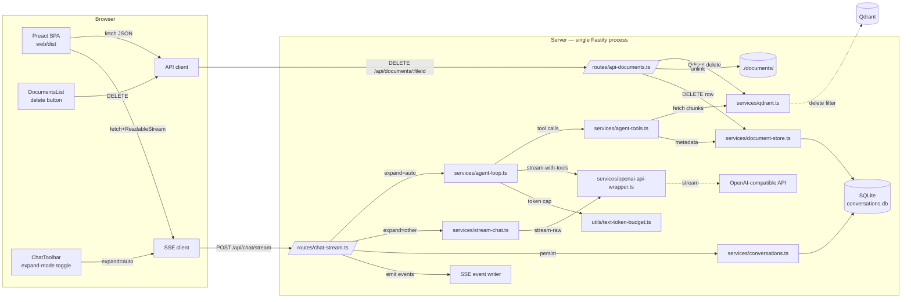

# Design — Phase 03

## Architecture overview



Three new surfaces; two existing surfaces extended:

1. **Documents API** — new `routes/api-documents.ts` for `GET /api/documents` and `DELETE /api/documents/:fileId`. Backed by a new `documents` SQLite table and a new `qdrant.deleteByFilePath()` primitive.
2. **Documents SPA** — new `services/documents.ts`, new `DocumentsList` component, integrated into `/upload` below the queue.
3. **Agentic RAG** — new `expand=auto` mode. Adds `services/agent-tools.ts`, `services/agent-loop.ts`, `utils/text-token-budget.ts`; extends `openai-api-wrapper.ts` with `streamChatCompletionWithTools`; extends `routes/chat-stream.ts` to dispatch to the agent loop; extends the SSE envelope with `event: tool_call` and `event: tool_result`; extends `services/conversations.ts` with `toolCalls` persistence.
4. **Chat toolbar** — existing topbar gets an expand-mode toggle (`None` / `Siblings` / `Sections` / `Auto`), persisted in `localStorage`.
5. **Bubble** — existing component renders tool-call and tool-result chips.

Routing discipline is unchanged from Phase 02: API under `/api/*`, pages under `/{page}`. The new `/api/documents` endpoints follow the convention. No new page routes — DocumentsList is embedded on `/upload`.

## Tech stack

No new dependencies. The existing `package.json` covers everything:

| Concern | Existing dep | Notes |
|---|---|---|
| OpenAI tool-use streaming | `openai` (already) | `chat.completions.create({ tools, stream: true })` — supports tool_calls. |
| Token counting + truncation | `gpt-tokenizer` (already, in chunker) | Reuse `countTokens` from `utils/chunk-tokenizer.ts`. |
| SQLite + migrations | `better-sqlite3` (already) | New `ALTER TABLE` in migration 004. |
| Qdrant filter delete | `@qdrant/qdrant-js` (already) | `client.delete(collection, { filter })`. |
| Pino logging | `pino` (already) | Per-component child loggers. |

## Module / package layout

```
repo/
  src/
    db/
      migrations/
        003_documents.sql                # NEW — documents table
        004_tool_calls.sql               # NEW — ALTER messages ADD tool_calls
    services/
      document-store.ts                  # NEW — DocumentStore CRUD (insert on upload, list, get, delete)
      agent-tools.ts                     # NEW — the four tool implementations
      agent-loop.ts                      # NEW — bounded agent loop generator
      openai-api-wrapper.ts              # EXTENDED — streamChatCompletionWithTools
      conversations.ts                   # EXTENDED — appendAssistantMessage(..., toolCalls)
      stream-chat.ts                     # UNCHANGED (used for expand=none|siblings|sections)
      qdrant.ts                          # EXTENDED — deleteByFilePath, fetchByFilePathAndIndex/HeadingPath promoted to public
    routes/
      api-documents.ts                   # NEW — GET /api/documents, DELETE /api/documents/:fileId
      chat-stream.ts                     # EXTENDED — dispatch to agent-loop when expand=auto
    utils/
      text-token-budget.ts               # NEW — truncateToTokenBudget(text, budget)
    index.ts                             # EXTENDED — register api-documents
  web/
    src/
      components/
        DocumentsList.tsx                # NEW
        ToolCallChip.tsx                 # NEW
        ToolResultChip.tsx               # NEW
        Bubble.tsx                       # EXTENDED — render tool-call/result chips
        TopBar.tsx                       # (unchanged; expand-mode toggle lives in Chat.tsx toolbar)
      routes/
        Upload.tsx                       # EXTENDED — render DocumentsList below queue
        Chat.tsx                         # EXTENDED — expand-mode toggle in toolbar; pass to stream service
      services/
        documents.ts                     # NEW — listDocuments, deleteDocument
        stream.ts                        # EXTENDED — handle tool_call, tool_result events
        sessions.ts                      # UNCHANGED
      types.d.ts                         # EXTENDED — Document, ToolCall, ToolResult shapes
  tests/
    services/
      document-store.test.ts             # NEW
      agent-tools.test.ts                # NEW
      agent-loop.test.ts                 # NEW
      openai-api-wrapper.test.ts         # EXTENDED — streamChatCompletionWithTools
      qdrant.test.ts                     # EXTENDED — deleteByFilePath
      conversations.test.ts              # EXTENDED — toolCalls append
    routes/
      api-documents.test.ts              # NEW
      chat-stream.test.ts                # EXTENDED — expand=auto path
    components/  (under web/, scanned by vitest workspaces)
      DocumentsList.test.tsx             # NEW
      ToolCallChip.test.tsx              # NEW
      ToolResultChip.test.tsx            # NEW
      Bubble.test.tsx                    # EXTENDED — tool chips
    e2e/
      document-deletion.test.ts          # NEW
      agentic-chat.test.ts               # NEW (stubbed LLM via env override)
  docs/specs/phase-03-document-deletion-and-agentic-rag/
    README.md
    requirements.md
    design.md
    TASKS.md
  README.md                              # EXTENDED — env vars, new endpoints, expand-mode docs
```

## Data model

### Migration `003_documents.sql`

```sql
-- Phase 03 / p3-T01: track uploaded documents so we can list and delete them.
--
-- file_id is the SAME UUIDv4 used in the on-disk filename (the existing
-- upload route does `${fileId}${ext}` to derive the on-disk name).
-- It's the public API identifier — DELETE /api/documents/:fileId.
--
-- file_name is the original user-facing filename. Can repeat across
-- rows if the same file is uploaded twice (each gets a fresh UUID).
-- Not unique.
--
-- file_type is the lower-case extension without the dot (e.g. 'pdf',
-- 'md'). Matches the existing chunk payload's `fileType` field.
--
-- bytes is the size of the uploaded file on disk. Surfaced in the
-- Documents list for UX.
--
-- uploaded_at is the SQLite `datetime('now')` of the successful
-- upsert — NOT the time the file landed on disk (which could be a
-- few ms earlier if the disk write completed first).
--
-- chunk_count is the number of Qdrant points whose payload.filePath
-- equals `${fileId}${ext}`. Updated on upload completion; not
-- recomputed on delete (delete returns the count it actually
-- removed from Qdrant, but the SQLite row is gone by then).
--
-- No FK to messages — conversations cite files via path/name, not
-- by file_id. Source chips in old assistant messages survive
-- document deletion (they're historical; the user already saw them).

CREATE TABLE IF NOT EXISTS documents (
  file_id TEXT PRIMARY KEY,
  file_name TEXT NOT NULL,
  file_type TEXT NOT NULL,
  bytes INTEGER NOT NULL,
  uploaded_at TEXT NOT NULL DEFAULT (datetime('now')),
  chunk_count INTEGER NOT NULL DEFAULT 0
);

CREATE INDEX IF NOT EXISTS idx_documents_uploaded_at
  ON documents (uploaded_at DESC);
```

### Migration `004_tool_calls.sql`

```sql
-- Phase 03 / p3-T04: persist agent-loop tool calls on assistant messages.
--
-- tool_calls is JSON-encoded Array<ToolCallRecord>. Nullable.
-- Existing rows get NULL (the ALTER ADD COLUMN with NULL default
-- doesn't rewrite the table — better-sqlite3 stores NULL inline
-- for existing rows without a migration copy).
--
-- ToolCallRecord shape:
--   { name: string, arguments: object, result: unknown,
--     truncated: boolean, iteration: number }
--
-- `result` is whatever JSON the LLM saw — could be a chunk list,
-- document metadata, or a not-found error. The client renders it
-- via the ToolResultChip.

ALTER TABLE messages ADD COLUMN tool_calls TEXT;
```

### TypeScript types

```ts
// src/services/document-store.ts
export interface DocumentRow {
  fileId: string;
  fileName: string;
  fileType: string;
  bytes: number;
  uploadedAt: string;
  chunkCount: number;
}

// src/services/agent-tools.ts
export interface ToolCallRecord {
  name: string;
  arguments: Record<string, unknown>;
  result: unknown;
  truncated: boolean;
  iteration: number;
}

// src/services/conversations.ts (extended)
export interface Message {
  // ... existing fields ...
  toolCalls?: ToolCallRecord[];   // NEW — present only on agentic assistant messages
}

// web/src/types.d.ts (extended)
export interface Document {
  fileId: string;
  fileName: string;
  fileType: string;
  bytes: number;
  uploadedAt: string;
  chunkCount: number;
}

export interface ToolCallRecord {
  name: string;
  arguments: Record<string, unknown>;
  result: unknown;
  truncated: boolean;
  iteration: number;
}
```

## API surface

### Internal

```ts
// src/services/document-store.ts (NEW)
export class DocumentStore {
  constructor(private readonly db: DB) {}

  insert(row: DocumentRow): void;                           // called from upload route on success
  list(): DocumentRow[];                                    // ordered by uploaded_at DESC
  get(fileId: string): DocumentRow | null;                  // for delete handler's lookup
  delete(fileId: string): boolean;                          // FK-less; idempotent
}

// src/services/qdrant.ts (EXTENDED)
export async function deleteByFilePath(filePath: string): Promise<number>;
// Returns the count of points deleted. Idempotent — safe on empty collections.
export async function fetchByFilePathAndIndex(             // PROMOTED from private to public
  filePath: string,
  chunkIndex: number
): Promise<DocumentChunk[]>;
export async function fetchByFilePathAndHeadingPath(       // PROMOTED from private to public
  filePath: string,
  headingPath: string[]
): Promise<DocumentChunk[]>;

// src/services/agent-tools.ts (NEW)
export const AGENT_TOOLS: ChatCompletionTool[];             // the four tool definitions
export type AgentToolName =
  | 'get_neighbor_chunks'
  | 'get_section_chunks'
  | 'get_chunk'
  | 'get_document';
export type AgentToolResult =
  | { kind: 'chunks'; chunks: ToolChunk[]; truncated: boolean }
  | { kind: 'document'; document: DocumentRow | null }
  | { kind: 'error'; code: 'NOT_FOUND' | 'INVALID_ARG'; message: string };

export async function executeAgentTool(
  name: AgentToolName,
  args: Record<string, unknown>
): Promise<AgentToolResult>;

// src/services/agent-loop.ts (NEW)
export async function* streamAgentChat(
  params: {
    question: string;
    sessionId: string;
    limit?: number;
  },
  signal: AbortSignal
): AsyncGenerator<StreamEvent>;

// src/services/openai-api-wrapper.ts (EXTENDED)
export async function* streamChatCompletionWithTools(
  messages: ChatCompletionMessageParam[],
  tools: ChatCompletionTool[],
  signal: AbortSignal
): AsyncGenerator<{ text: string; toolCalls: ToolCallDelta[] }>;

// src/services/stream-chat.ts (UNCHANGED for non-agentic)
export type StreamEvent =
  | { type: 'meta'; sessionId: string; userMessageId: string }
  | { type: 'sources'; sources: DocumentChunk[] }
  | { type: 'token'; text: string }
  | { type: 'tool_call'; name: string; arguments: Record<string, unknown>; iteration: number }   // NEW
  | { type: 'tool_result'; name: string; result: AgentToolResult; truncated: boolean; iteration: number }  // NEW
  | { type: 'done'; messageId?: string; totalTokens?: number; iterations?: number }              // CHANGED — added iterations
  | { type: 'error'; message: string };
```

### HTTP

| Endpoint | Method | Purpose | Notes |
|---|---|---|---|
| `/api/documents` | `GET` | List documents | `[{fileId, fileName, fileType, chunkCount, bytes, uploadedAt}]`, ordered by uploaded_at DESC. |
| `/api/documents/:fileId` | `DELETE` | Remove document | 404 if not found; 400 if invalid fileId; 500 if Qdrant delete fails. Body: `{success, chunksDeleted, fileId}`. |
| `/api/status` | `GET` | Adds `documents` field | Existing fields unchanged. |
| `/api/chat/stream` | `POST` | New `expand=auto` path | Adds `tool_call` / `tool_result` SSE events; `done` event gains `iterations`. |

No changes to the HTTP shape of `/api/chat`, `/api/search`, `/api/search/rag`, `/api/upload`, `/api/sessions*`, `/api/health`.

## Key algorithms

### Qdrant filter delete

```ts
// src/services/qdrant.ts (new export)
export async function deleteByFilePath(filePath: string): Promise<number> {
  log.debug({ filePath }, 'Deleting chunks by filePath');
  const result = await client.delete(COLLECTION_NAME, {
    filter: {
      must: [{ key: 'filePath', match: { value: filePath } }],
    } as unknown as Record<string, unknown>,
  });
  // Qdrant returns { result: { operation_id }, status: 'acknowledged' } for
  // async deletes. The synchronous count is in result.completed or via a
  // follow-up count call. For our purposes the count is best-effort.
  const deleted = (result as unknown as { result?: { deleted?: number } })
    .result?.deleted ?? 0;
  log.info({ filePath, deleted }, 'Chunks deleted by filePath');
  return deleted;
}
```

### Document delete (route handler)

```ts
// src/routes/api-documents.ts (sketch)
fastify.delete<{ Params: { fileId: string } }>(
  '/api/documents/:fileId',
  async (request, reply) => {
    const { fileId } = request.params;
    if (!/^[A-Za-z0-9_-]{1,64}$/.test(fileId)) {
      return reply.status(400).send({ error: 'Invalid fileId' });
    }

    const store = new DocumentStore(db);
    const row = store.get(fileId);
    if (!row) {
      return reply.status(404).send({ error: 'Document not found' });
    }

    const ext = path.extname(row.fileName).toLowerCase();
    const onDiskName = `${fileId}${ext}`;
    const fullPath = path.join(UPLOAD_DIR, onDiskName);

    // 1. Qdrant delete — if this fails, abort. (FR-5 order.)
    let chunksDeleted = 0;
    try {
      chunksDeleted = await deleteByFilePath(onDiskName);
    } catch (err) {
      log.error({ err, fileId }, 'Qdrant delete failed');
      return reply.status(500).send({ error: 'Failed to delete chunks' });
    }

    // 2. File unlink — best-effort. (FR-5: missing file is logged, not fatal.)
    try {
      await fs.unlink(fullPath);
    } catch (err) {
      if ((err as NodeJS.ErrnoException).code !== 'ENOENT') {
        log.warn({ err, fullPath }, 'File unlink failed (non-fatal)');
      }
    }

    // 3. SQLite delete.
    store.delete(fileId);

    return { success: true, chunksDeleted, fileId };
  }
);
```

### Upload integration

```ts
// src/routes/upload.ts (existing processUpload — sketch of the insertion point)
async function processUpload(filePath, fileName, fileId, parsed): Promise<ProcessUploadResult> {
  // ... existing chunk + embed + upsert logic ...
  // On success:
  const docStore = new DocumentStore(db);
  docStore.insert({
    fileId,
    fileName,
    fileType: parsed.fileType,
    bytes: fsSync.statSync(filePath).size,
    chunkCount: totalIndexed,
    uploadedAt: nowIso(),
  });
  return { status: 'success', fileName, fileId, chunksIndexed: totalIndexed };
}
```

Note: the SQLite insert happens AFTER successful Qdrant upsert. If parsing/embedding fails before this point, no row is created (consistent with Phase 02's behavior of unlinking the file on failure).

### Agent tool definitions

```ts
// src/services/agent-tools.ts
import type { ChatCompletionTool } from 'openai/resources/chat/completions';

export const AGENT_TOOLS: ChatCompletionTool[] = [
  {
    type: 'function',
    function: {
      name: 'get_neighbor_chunks',
      description:
        'Fetch chunks immediately before and after a given chunk within the same document. ' +
        'Use to see what comes before or after a passage that looked relevant.',
      parameters: {
        type: 'object',
        properties: {
          filePath: { type: 'string', description: 'Internal filePath of the source document.' },
          chunkIndex: { type: 'integer', description: 'Chunk index to center the window on.', minimum: 0 },
          range: { type: 'integer', description: 'How many chunks on each side (default 2, max 5).', minimum: 1, maximum: 5 },
        },
        required: ['filePath', 'chunkIndex'],
      },
    },
  },
  {
    type: 'function',
    function: {
      name: 'get_section_chunks',
      description:
        'Fetch all chunks in the same heading section of a given document. ' +
        'Use to see the full context surrounding a passage.',
      parameters: {
        type: 'object',
        properties: {
          filePath: { type: 'string', description: 'Internal filePath of the source document.' },
          headingPath: {
            type: 'array',
            items: { type: 'string' },
            description: 'Heading path (e.g. ["Chapter 2", "Setup"]).',
          },
        },
        required: ['filePath', 'headingPath'],
      },
    },
  },
  {
    type: 'function',
    function: {
      name: 'get_chunk',
      description: 'Fetch a specific chunk by its ID. Use to drill into a specific passage.',
      parameters: {
        type: 'object',
        properties: {
          chunkId: { type: 'string', description: 'Chunk ID returned by an earlier search or tool call.' },
        },
        required: ['chunkId'],
      },
    },
  },
  {
    type: 'function',
    function: {
      name: 'get_document',
      description:
        'Fetch metadata for a document by its internal filePath. ' +
        'Use to discover what a document contains without re-running a search.',
      parameters: {
        type: 'object',
        properties: {
          filePath: { type: 'string', description: 'Internal filePath of the document.' },
        },
        required: ['filePath'],
      },
    },
  },
];
```

### Agent tool execution

```ts
// src/services/agent-tools.ts (sketch)
export async function executeAgentTool(
  name: AgentToolName,
  args: Record<string, unknown>
): Promise<AgentToolResult> {
  switch (name) {
    case 'get_neighbor_chunks': {
      const filePath = args.filePath;
      const chunkIndex = args.chunkIndex;
      const range = Math.min(args.range ?? 2, 5);
      if (typeof filePath !== 'string' || typeof chunkIndex !== 'number') {
        return { kind: 'error', code: 'INVALID_ARG', message: 'filePath and chunkIndex required' };
      }
      const chunks = [];
      for (let delta = -range; delta <= range; delta++) {
        if (delta === 0) continue;
        const target = chunkIndex + delta;
        if (target < 0) continue;
        const neighbors = await fetchByFilePathAndIndex(filePath, target);
        chunks.push(...neighbors);
      }
      return { kind: 'chunks', chunks: chunks.map(toToolChunk), truncated: false };
    }
    case 'get_section_chunks': {
      const filePath = args.filePath;
      const headingPath = args.headingPath;
      if (typeof filePath !== 'string' || !Array.isArray(headingPath)) {
        return { kind: 'error', code: 'INVALID_ARG', message: 'filePath and headingPath[] required' };
      }
      const chunks = await fetchByFilePathAndHeadingPath(filePath, headingPath as string[]);
      return { kind: 'chunks', chunks: chunks.map(toToolChunk), truncated: false };
    }
    case 'get_chunk': {
      const chunkId = args.chunkId;
      if (typeof chunkId !== 'string') {
        return { kind: 'error', code: 'INVALID_ARG', message: 'chunkId required' };
      }
      const point = await qdrantClient.retrieve(COLLECTION_NAME, { ids: [chunkId] });
      if (!point || point.length === 0) {
        return { kind: 'error', code: 'NOT_FOUND', message: 'Chunk not found' };
      }
      return { kind: 'chunks', chunks: point.map(toToolChunk), truncated: false };
    }
    case 'get_document': {
      const filePath = args.filePath;
      if (typeof filePath !== 'string') {
        return { kind: 'error', code: 'INVALID_ARG', message: 'filePath required' };
      }
      // filePath in this context = the on-disk basename = `${fileId}${ext}`
      // strip the extension to get fileId
      const fileId = filePath.replace(/\.[^.]+$/, '');
      const doc = new DocumentStore(db).get(fileId);
      if (!doc) {
        return { kind: 'error', code: 'NOT_FOUND', message: 'Document not found' };
      }
      return { kind: 'document', document: doc };
    }
  }
}

function toToolChunk(c: DocumentChunk): ToolChunk {
  return {
    chunkId: c.id,
    fileName: c.payload.fileName,
    filePath: c.payload.filePath,
    chunkIndex: c.payload.chunkIndex,
    pageNumber: c.payload.pageNumber,
    headingPath: c.payload.headingPath,
    text: c.payload.chunk,
  };
}
```

### Stream-with-tools wrapper

```ts
// src/services/openai-api-wrapper.ts (additive)
import type { ChatCompletionTool, ChatCompletionMessageParam } from 'openai/resources/chat/completions';

interface ToolCallDelta {
  index: number;
  id?: string;
  name?: string;
  arguments: string;     // accumulated as the stream emits partial JSON
}

export async function* streamChatCompletionWithTools(
  messages: ChatCompletionMessageParam[],
  tools: ChatCompletionTool[],
  signal: AbortSignal
): AsyncGenerator<{ text: string; toolCalls: ToolCallDelta[] }> {
  const stream = await openai.chat.completions.create(
    {
      model: LLM_MODEL,
      messages,
      tools,
      temperature: 0.3,
      max_tokens: 1000,
      stream: true,
    },
    { signal }
  );

  // Accumulator for incremental tool_calls. The OpenAI SDK emits
  // tool_calls as a partial array per chunk: each entry has an
  // `index`, and incremental `id` / `function.name` / `function.arguments`
  // fields. We merge them into a single record per call.
  const calls: ToolCallDelta[] = [];

  for await (const chunk of stream) {
    if (signal.aborted) return;
    const delta = chunk.choices?.[0]?.delta;
    if (delta?.content) {
      yield { text: delta.content, toolCalls: [] };
    }
    const tc = delta?.tool_calls;
    if (tc && tc.length > 0) {
      for (const t of tc) {
        const idx = t.index ?? 0;
        if (!calls[idx]) {
          calls[idx] = { index: idx, arguments: '' };
        }
        if (t.id) calls[idx].id = t.id;
        if (t.function?.name) calls[idx].name = t.function.name;
        if (t.function?.arguments) calls[idx].arguments += t.function.arguments;
      }
      // Yield a snapshot each chunk so the caller can stream
      // tool_call events as they're finalized. (Caller only emits
      // the final snapshot after stream-end to avoid duplicates.)
      yield { text: '', toolCalls: [...calls] };
    }
  }

  // Final yield with the completed tool_calls. Caller emits this as
  // event: tool_call (one per call). Subsequent calls return
  // `toolCalls: []` until the next stream ends.
}
```

### Agent loop

```ts
// src/services/agent-loop.ts (sketch)
import { stripThinkTags, ... } from './openai-api-wrapper.js';
import { AGENT_TOOLS, executeAgentTool, type AgentToolResult, type ToolCallRecord } from './agent-tools.js';
import { embedText } from './embed.js';
import { searchChunks, type DocumentChunk } from './qdrant.js';
import { streamChatCompletionWithTools } from './openai-api-wrapper.js';
import type { ChatCompletionMessageParam } from 'openai/resources/chat/completions';
import { countTokens, truncateToTokenBudget } from '../utils/text-token-budget.js';
import { chatLog as log } from '../utils/logger.js';

const MAX_AGENT_ITERATIONS = parseInt(process.env.MAX_AGENT_ITERATIONS || '3', 10);
const TOOL_RESULT_TOKEN_CAP = parseInt(process.env.TOOL_RESULT_TOKEN_CAP || '10000', 10);
const TOOL_CALL_CONCURRENCY = 4;

const SYSTEM_PROMPT = `You are a helpful assistant that answers questions based on the user's documents.
You have access to four retrieval tools:
  - get_neighbor_chunks(filePath, chunkIndex, range): see what comes before/after a passage
  - get_section_chunks(filePath, headingPath): see the full section a passage came from
  - get_chunk(chunkId): fetch a specific chunk by ID
  - get_document(filePath): see what a document contains
Use them when the initial context isn't enough to answer confidently.
When you have enough context, respond with the answer and no tool calls.`;

export async function* streamAgentChat(
  params: { question: string; sessionId: string; limit?: number; conversationHistory?: ChatMessage[] },
  signal: AbortSignal
): AsyncGenerator<StreamEvent> {
  const limit = params.limit ?? 5;

  // Initial retrieval (cheap, always done — gives the LLM a starting point).
  let queryVector: number[];
  try {
    queryVector = await embedText(params.question);
  } catch (err) {
    yield { type: 'error', message: 'embedding unavailable' };
    return;
  }
  const baseResults = await searchChunks(queryVector, { limit });
  yield { type: 'sources', sources: baseResults };

  const collectedSources: DocumentChunk[] = [...baseResults];
  const toolCallRecords: ToolCallRecord[] = [];

  const messages: ChatCompletionMessageParam[] = [
    { role: 'system', content: SYSTEM_PROMPT },
    {
      role: 'user',
      content:
        `Conversation History:\n${buildHistoryText(params.conversationHistory ?? []) || 'No previous conversation'}\n\n` +
        `Relevant Documents:\n${formatChunksForPrompt(baseResults) || '(no matching documents — call get_document to find them)'}\n\n` +
        `Current Question: ${params.question}`,
    },
  ];

  for (let iter = 0; iter < MAX_AGENT_ITERATIONS; iter++) {
    if (signal.aborted) return;

    // Stream one LLM call.
    let textAccum = '';
    let finalToolCalls: ToolCallDelta[] = [];
    try {
      for await (const ev of streamChatCompletionWithTools(messages, AGENT_TOOLS, signal)) {
        if (signal.aborted) return;
        if (ev.text) {
          textAccum += ev.text;
          yield { type: 'token', text: ev.text };
        }
        if (ev.toolCalls.length > 0) {
          finalToolCalls = ev.toolCalls;
        }
      }
    } catch (err) {
      if (signal.aborted) return;
      yield { type: 'error', message: 'Chat failed' };
      return;
    }

    // Filter to complete tool calls (have id + name + non-empty arguments).
    const completeCalls = finalToolCalls.filter((c) => c.id && c.name);
    if (completeCalls.length === 0) {
      // No tools called — final answer.
      yield { type: 'done', iterations: iter + 1 };
      return;
    }

    // Append the assistant's message (with tool_calls) to the conversation.
    messages.push({
      role: 'assistant',
      content: textAccum,
      tool_calls: completeCalls.map((c) => ({
        id: c.id!,
        type: 'function' as const,
        function: { name: c.name!, arguments: c.arguments },
      })),
    });

    // Emit one tool_call event per call BEFORE execution.
    for (const c of completeCalls) {
      let parsedArgs: Record<string, unknown> = {};
      try { parsedArgs = JSON.parse(c.arguments); } catch { /* malformed — emit with empty */ }
      yield {
        type: 'tool_call',
        name: c.name!,
        arguments: parsedArgs,
        iteration: iter,
      };
    }

    // Execute tool calls (bounded parallel) with incremental token cap.
    let tokenTotal = 0;
    const execResults: Array<{ call: ToolCallDelta; result: AgentToolResult; truncated: boolean }> = [];

    // Sequential execution (parallel would lose ordering for cap math).
    for (const c of completeCalls) {
      if (signal.aborted) return;
      let parsedArgs: Record<string, unknown> = {};
      try { parsedArgs = JSON.parse(c.arguments); } catch { /* malformed */ }
      const result = await executeAgentTool(c.name as AgentToolName, parsedArgs);
      const resultJson = JSON.stringify(result);
      const resultTokens = countTokens(resultJson);

      let truncated = false;
      let finalJson = resultJson;
      if (tokenTotal + resultTokens > TOOL_RESULT_TOKEN_CAP) {
        const remaining = Math.max(TOOL_RESULT_TOKEN_CAP - tokenTotal, 0);
        if (remaining > 0) {
          finalJson = truncateToTokenBudget(resultJson, remaining);
        } else {
          finalJson = '{"truncated":true}';
        }
        truncated = true;
      }
      tokenTotal += countTokens(finalJson);
      execResults.push({ call: c, result, truncated });

      yield {
        type: 'tool_result',
        name: c.name!,
        result: parseToolResultJson(finalJson),
        truncated,
        iteration: iter,
      };

      // Track chunks retrieved via tools as sources for citation.
      if (result.kind === 'chunks') {
        for (const tc of result.chunks) {
          if (!collectedSources.find((s) => s.id === tc.chunkId)) {
            // ToolChunk → DocumentChunk (synthetic; enough for citation rendering).
            collectedSources.push(toDocumentChunk(tc));
          }
        }
      }
    }

    // Append tool messages to the conversation so the next LLM call sees them.
    for (const { call, result, truncated } of execResults) {
      messages.push({
        role: 'tool',
        tool_call_id: call.id!,
        content: truncated ? '{"truncated":true}' : JSON.stringify(result),
      });
      toolCallRecords.push({
        name: call.name!,
        arguments: safeParseArgs(call.arguments),
        result,
        truncated,
        iteration: iter,
      });
    }
  }

  // Hit max iterations without a final answer — emit done with accumulated state.
  yield { type: 'done', iterations: MAX_AGENT_ITERATIONS };
}

// Helpers (sketch):
function formatChunksForPrompt(chunks: DocumentChunk[]): string { /* ... */ }
function buildHistoryText(history: ChatMessage[]): string { /* ... */ }
function parseToolResultJson(json: string): unknown { try { return JSON.parse(json); } catch { return json; } }
function safeParseArgs(s: string): Record<string, unknown> { try { return JSON.parse(s); } catch { return {}; } }
function toDocumentChunk(tc: ToolChunk): DocumentChunk { /* ... */ }
```

### Stream-with-tools SSE dispatch (chat-stream route)

```ts
// src/routes/chat-stream.ts (extended)
import { streamAgentChat } from '../services/agent-loop.js';
import { streamChatCompletion } from '../services/stream-chat.js';

fastify.post('/api/chat/stream', async (request, reply) => {
  // ... existing validation + headers + abort controller ...
  const expandMode = parseExpandMode(expand);

  for await (const ev of expandMode === 'auto'
    ? streamAgentChat({ question: q, sessionId: validSid, limit: limitNum, conversationHistory: history }, ac.signal)
    : streamChatCompletion({ question: q, sessionId: validSid, conversationHistory: history, limit: limitNum, expandMode }, ac.signal)) {
    if (ac.signal.aborted) break;

    if (ev.type === 'token') {
      // existing think-filter + writeEvent logic
    } else if (ev.type === 'sources') {
      eventSources = ev.sources.map(...);
      writeEvent(reply.raw, 'sources', eventSources);
    } else if (ev.type === 'tool_call') {
      writeEvent(reply.raw, 'tool_call', { name: ev.name, arguments: ev.arguments, iteration: ev.iteration });
    } else if (ev.type === 'tool_result') {
      writeEvent(reply.raw, 'tool_result', {
        name: ev.name,
        result: ev.result,
        truncated: ev.truncated,
        iteration: ev.iteration,
      });
    } else if (ev.type === 'error') {
      writeEvent(reply.raw, 'error', { message: ev.message });
    } else if (ev.type === 'done') {
      // existing think-filter flush + persist assistant message
      // NEW: if expand=auto, include ev.iterations in the done event
      writeEvent(reply.raw, 'done', {
        messageId: assistantMessageId,
        iterations: ev.iterations ?? 1,
      });
    }
  }

  // Persist with toolCalls (only if expand=auto + there were tool calls).
  if (expandMode === 'auto' && toolCallRecords.length > 0) {
    store.appendAssistantMessage(validSid, persistedText, eventSources, toolCallRecords);
  } else {
    // existing appendAssistantMessage(sid, text, sources) — tool_calls column stays NULL
  }
});
```

### Token budget helper

```ts
// src/utils/text-token-budget.ts (NEW)
import { encode } from 'gpt-tokenizer';

export function countTokens(text: string): number {
  return encode(text).length;
}

export function truncateToTokenBudget(text: string, budget: number): string {
  if (budget <= 0) return '';
  const tokens = encode(text);
  if (tokens.length <= budget) return text;
  return new TextDecoder().decode(
    new TextEncoder().encode(
      // Re-encode the truncated token list back to a string. The
      // gpt-tokenizer encode returns number[]; we use the
      // Uint8Array<ArrayBuffer> → TextDecoder round-trip for safety
      // on multi-byte content. For our use (chunk text) this is
      // idempotent.
      tokens.slice(0, budget).map((t) => String.fromCodePoint(t)).join('')
    )
  );
}
```

Note: the round-trip encoding is approximate. For our use case (truncating chunk text to a token budget), we accept the approximation — the alternative (round-tripping via encode/decode of the byte stream) loses information for tokens split across multi-byte chars. For Phase 03, the approximation is fine; a future optimization can use `decodeGeneratorTokens` or similar from `gpt-tokenizer` for exact decoding.

### Documents SPA service

```ts
// web/src/services/documents.ts (NEW)
import type { Document } from '../types';

async function jsonOrThrow<T>(res: Response): Promise<T> { /* shared with sessions.ts */ }

export async function listDocuments(): Promise<Document[]> {
  const res = await fetch('/api/documents');
  const body = await jsonOrThrow<{ documents: Document[] }>(res);
  return body.documents;
}

export async function deleteDocument(fileId: string): Promise<void> {
  const res = await fetch(`/api/documents/${encodeURIComponent(fileId)}`, {
    method: 'DELETE',
  });
  if (!res.ok && res.status !== 404) {
    await jsonOrThrow(res);
  }
}
```

### DocumentsList component (sketch)

```tsx
// web/src/components/DocumentsList.tsx (NEW)
interface Props {
  documents: Document[];
  onDelete: (fileId: string) => Promise<void>;
  pendingFileId?: string;   // disables the delete button while a request is in flight
}

export function DocumentsList({ documents, onDelete, pendingFileId }: Props) {
  const [confirmId, setConfirmId] = useState<string | null>(null);
  const [errorFileId, setErrorFileId] = useState<string | null>(null);

  // 5-second confirm window.
  useEffect(() => {
    if (!confirmId) return;
    const t = window.setTimeout(() => setConfirmId(null), 5000);
    return () => window.clearTimeout(t);
  }, [confirmId]);

  if (documents.length === 0) {
    return <div class="documents-empty">No documents indexed yet.</div>;
  }

  return (
    <div class="documents-list">
      <h3>Documents <span class="count">{documents.length}</span></h3>
      <ul>
        {documents.map((doc) => (
          <DocumentRow
            key={doc.fileId}
            doc={doc}
            isConfirming={confirmId === doc.fileId}
            isPending={pendingFileId === doc.fileId}
            hasError={errorFileId === doc.fileId}
            onClick={() => {
              if (confirmId === doc.fileId) {
                setErrorFileId(null);
                onDelete(doc.fileId).catch(() => setErrorFileId(doc.fileId));
                setConfirmId(null);
              } else {
                setConfirmId(doc.fileId);
              }
            }}
            onDismissError={() => setErrorFileId(null)}
          />
        ))}
      </ul>
    </div>
  );
}
```

### Tool-call / tool-result chips

```tsx
// web/src/components/ToolCallChip.tsx (NEW — sketch)
export function ToolCallChip({ name, args, iteration, result }: { name: string; args: Record<string, unknown>; iteration: number; result?: ToolResultChip }) {
  const [expanded, setExpanded] = useState(false);
  const summary = previewArgs(args);  // e.g. "get_neighbor_chunks(notes.md, 12, range=2)"
  return (
    <div class="tool-chip" data-kind="call">
      <button class="tool-chip-head" onClick={() => setExpanded(!expanded)}>
        <span class="tool-icon">⚙</span>
        <span class="tool-name">{name}</span>
        <span class="tool-summary">{summary}</span>
        <span class="tool-iter">iter {iteration + 1}</span>
      </button>
      {expanded && (
        <div class="tool-chip-body">
          <pre class="tool-args">{JSON.stringify(args, null, 2)}</pre>
          {result && <ToolResultChip {...result} />}
        </div>
      )}
    </div>
  );
}
```

```tsx
// web/src/components/ToolResultChip.tsx (NEW — sketch)
export function ToolResultChip({ name, result, truncated, iteration }: { name: string; result: unknown; truncated: boolean; iteration: number }) {
  const [expanded, setExpanded] = useState(false);
  const summary = summarizeResult(name, result);  // e.g. "3 chunks" / "metadata"
  return (
    <div class="tool-chip" data-kind="result">
      <button class="tool-chip-head" onClick={() => setExpanded(!expanded)}>
        <span class="tool-icon">↩</span>
        <span class="tool-name">{name}</span>
        <span class="tool-summary">{summary}</span>
        {truncated && <span class="tool-truncated">truncated</span>}
      </button>
      {expanded && (
        <div class="tool-chip-body">
          <pre class="tool-result">{truncated ? truncateForDisplay(JSON.stringify(result, null, 2), 1500) : JSON.stringify(result, null, 2)}</pre>
        </div>
      )}
    </div>
  );
}
```

### Bubble wiring

```tsx
// web/src/components/Bubble.tsx (extended — sketch of the new section)
{toolCalls?.map((tc, i) => (
  <ToolCallChip
    key={i}
    name={tc.name}
    args={tc.arguments}
    iteration={tc.iteration}
    result={{ name: tc.name, result: tc.result, truncated: tc.truncated, iteration: tc.iteration }}
  />
))}
```

### Expand-mode toggle

```tsx
// web/src/routes/Chat.tsx (extended — sketch of the toolbar)
const [expandMode, setExpandMode] = useState<'none' | 'siblings' | 'sections' | 'auto'>(
  () => (localStorage.getItem('dockhoj.expandMode') as ExpandMode) ?? 'auto'   // default is 'auto' in Phase 03 (was 'none' in Phase 02)
);

function selectMode(mode: ExpandMode) {
  setExpandMode(mode);
  try { localStorage.setItem('dockhoj.expandMode', mode); } catch { /* ignore */ }
}

// In the toolbar JSX:
<div class="expand-mode-toggle">
  <button onClick={() => setPopoverOpen(!popoverOpen)}>
    <span class="mode-chip">{expandMode === 'auto' ? 'Auto' : capitalize(expandMode)}</span>
  </button>
  {popoverOpen && (
    <div class="mode-popover">
      {(['none', 'siblings', 'sections', 'auto'] as const).map((m) => (
        <button key={m} class={m === expandMode ? 'selected' : ''} onClick={() => { selectMode(m); setPopoverOpen(false); }}>
          {m === 'none' && 'None — no expansion (fastest)'}
          {m === 'siblings' && 'Siblings — ±2 chunks (fast)'}
          {m === 'sections' && 'Sections — full section (medium)'}
          {m === 'auto' && 'Auto — agentic (slowest, best answers)'}
        </button>
      ))}
    </div>
  )}
</div>
```

## State management

- **`documents` SQLite table** is the source of truth for the document metadata list. Survives restarts (same WAL mode as conversations). The DocumentsList reads it on mount and after each upload/delete.
- **`tool_calls` column on `messages`** stores per-assistant-message tool-call records. Survives restarts. The Bubble renders tool chips from this field on reload.
- **Chat toolbar expand-mode** is stored in `localStorage` (key `dockhoj.expandMode`). Read on mount; written on change. The chat send body always includes the current `expandMode`.
- **No client-side state store** (no Redux, no Zustand). Component-local state and `useState`/`useEffect` cover the new surfaces.

## Error handling strategy

| Failure | Behavior |
|---|---|
| `DELETE /api/documents/:fileId` — Qdrant delete fails | 500 JSON. Disk + SQLite untouched. User retries. |
| `DELETE /api/documents/:fileId` — file missing on disk | Logged at `warn`. SQLite delete still proceeds. Row gone. |
| `DELETE /api/documents/:fileId` — SQLite delete fails after Qdrant + file | 500 JSON. Qdrant is clean. SQLite row still exists. Next DELETE attempt is idempotent (Qdrant delete returns 0). |
| `DELETE /api/documents/:fileId` — invalid fileId | 400 JSON. |
| `DELETE /api/documents/:fileId` — fileId not in `documents` table | 404 JSON. SPA treats as "already gone" (success). |
| `GET /api/documents` — table empty | `[]`. |
| Agent loop — LLM provider doesn't support `tools` | OpenAI SDK throws. We catch at the `streamChatCompletionWithTools` boundary. The route falls back to non-agentic behavior (calls `streamChatCompletion` with `expand=none`). `toolCalls` is `null` on the persisted message. Logged at `warn` level. |
| Agent loop — LLM calls `tool_calls` with malformed `arguments` JSON | We `JSON.parse` defensively; on failure, treat as `{}` and proceed. The tool may return `INVALID_ARG`. Logged at `debug`. |
| Agent loop — tool returns `{kind: 'error', ...}` | The error is JSON-serialized as the tool result. The LLM sees it and can decide whether to retry with different args or fall back. Logged at `debug`. |
| Agent loop — `MAX_AGENT_ITERATIONS` exceeded without final answer | The loop emits `event: done` with `iterations: MAX_AGENT_ITERATIONS`. Whatever text was accumulated is persisted (or a placeholder if empty). |
| Agent loop — client disconnect mid-iteration | `signal.aborted` is checked between iterations, between tool calls, and inside the OpenAI stream. The loop returns cleanly. No orphan LLM call. |
| Agent loop — Qdrant retrieve fails | The tool returns `{kind: 'error', code: 'NOT_FOUND'}`. The LLM sees the error. Logged at `warn`. |
| Documents SPA — DELETE fails (500) | The DocumentsList row reappears with an inline error pill. The user can retry. |
| Documents SPA — user clicks delete on a row that just disappeared (concurrent refresh) | The DELETE returns 404 (already gone). SPA treats as success. |

## Testing strategy

- **Server unit:** `DocumentStore` CRUD against `:memory:` SQLite. `deleteByFilePath` against a real Qdrant (integration). Each agent tool against stubbed Qdrant + stubbed SQLite. `agent-loop.ts` with a stubbed `streamChatCompletionWithTools` returning canned `{text, toolCalls}` per call — assertions on iteration count, abort behavior, token cap application, `toolCalls` recording.
- **Server route (fastify.inject):** `/api/documents` happy + 404 + 400. `/api/documents/:fileId` happy + 404 + 500 (Qdrant mocked). `/api/chat/stream` with `expand=auto` emits the full SSE event sequence including `tool_call`/`tool_result` events. `/api/chat/stream` with `expand=auto` falls back to non-agentic when LLM doesn't support tools.
- **Client component:** `DocumentsList` (render, delete click, confirm window expiry, error state). `ToolCallChip` (expand/collapse, args preview). `ToolResultChip` (expand/collapse, truncated flag, summary). `Bubble` (renders tool chips when `toolCalls` is present).
- **E2E:** `tests/e2e/document-deletion.test.ts` — upload, list, delete, verify via search. `tests/e2e/agentic-chat.test.ts` — upload, send `expand=auto` chat, assert SSE event sequence. The E2E uses a stubbed LLM via `LLM_BASE_URL` pointing at a local mock server (returns canned tool-call + final-answer responses). Same approach for the route-level SSE test.
- **Coverage thresholds:** ≥ 80% lines on new code (`document-store.ts`, `agent-tools.ts`, `agent-loop.ts`, `api-documents.ts`, `web/src/components/DocumentsList.tsx`, `ToolCallChip.tsx`, `ToolResultChip.tsx`). Project overall ≥ 80%.

## Deployment / runtime

### New env vars

| Var | Default | Purpose |
|---|---|---|
| `MAX_AGENT_ITERATIONS` | `3` | Cap on the agent loop's LLM-call count. Higher = more thorough but slower + more expensive. |
| `TOOL_RESULT_TOKEN_CAP` | `10000` | Per-iteration cap on total tool-result tokens. Lower = smaller LLM context window; higher = more context per iteration. |

### Removed env vars

None.

### Docker

No changes to `Dockerfile` or `docker-compose.yml`. No new services, no new volumes, no new build steps. The new SQLite tables (`documents`, `tool_calls` column on `messages`) live in the existing SQLite volume.

## Security & privacy

- **Tool input validation:** every tool checks argument types before calling Qdrant/SQLite. Malformed arguments return `{kind: 'error', code: 'INVALID_ARG'}` instead of throwing.
- **Tool-result size cap:** `TOOL_RESULT_TOKEN_CAP` bounds the size of any single tool result's contribution to the LLM context. Combined with the per-iteration cap, a maliciously-large chunk text cannot blow up the LLM context window.
- **No user-supplied code paths:** tools are server-implemented; the LLM can only call them via the OpenAI tool-use API, not via arbitrary code execution.
- **Document file paths:** the `filePath` argument to tools is the on-disk basename (`${fileId}${ext}`). The tools don't accept arbitrary filesystem paths. The user can't ask the LLM to read `/etc/passwd` — there's no such tool.
- **DELETE rate limiting:** not in scope for this phase. The endpoint is for the same single-user self-hosted context as the rest of the API; no abuse vector.
- **Path traversal:** the `DELETE /api/documents/:fileId` route computes the on-disk path via `path.join(UPLOAD_DIR, `${fileId}${ext}`)` where `fileId` is regex-validated to `^[A-Za-z0-9_-]{1,64}$` and `ext` is `path.extname(row.fileName)` — safe. Even if `row.fileName` contains a traversal attempt, `path.extname` returns only the last extension (e.g. `.md`), and `fileId` is regex-bounded, so the final path stays inside `UPLOAD_DIR`.
- **Source persistence:** the assistant message's `sources` array survives document deletion (per FR-6). The SourceDrawer renders the cached chunk text — no new attack surface.

## Risks & mitigations

| Risk | Mitigation |
|---|---|
| LLM provider doesn't support `tools` | Catch the SDK error, fall back to `expand=none`. Logged. Persisted message has `toolCalls = null`. |
| LLM generates infinite tool calls | Bounded by `MAX_AGENT_ITERATIONS` (default 3). |
| Tool result blows up LLM context | Bounded by `TOOL_RESULT_TOKEN_CAP` (default 10K tokens). Truncation is per-iteration, lossy, with `truncated: true` flag for transparency. |
| Agent loop is slow (3 iterations × ~5s LLM latency = ~15s) | Acceptable for opt-in mode. The toolbar shows a "thinking" indicator while the loop runs. Future: `MAX_AGENT_WALL_MS` cap. |
| Document deletion during an in-flight chat | Race is benign — the chat may cite a chunk that just got deleted; the SourceDrawer handles it via the "file no longer available" footer (per OQ-5). |
| SQLite `documents` table drift from Qdrant | The `documents.chunk_count` is set on upload and never updated. If a manual Qdrant delete happens out-of-band, the count drifts. Acceptable for self-hosted single-user. |
| Concurrent DELETE on same fileId | Qdrant delete is idempotent. SQLite's `DELETE` on a non-existent row is a no-op (changes: 0). The second request returns 404 (already gone). |
| `truncateToTokenBudget` round-trip is approximate | Acceptable for our use case (chunk text). Future: use `gpt-tokenizer`'s `decodeGeneratorTokens` for exact decoding. |
| OpenAI SDK streaming shape changes across versions | Pinned in `package.json`. The shape we depend on (`delta.content`, `delta.tool_calls[]`) is stable across recent versions. |
| Test coverage gap on agent loop | The unit tests stub `streamChatCompletionWithTools` and assert on the iteration count, abort behavior, and token cap. The route test exercises the full SSE event sequence. |

## Implementation order

Each task is a reviewable commit; the spec's `TASKS.md` is the canonical list.

1. **p3-T01** — `003_documents.sql` + `DocumentStore` + wire into upload route + `documents` field on `/api/status`.
2. **p3-T02** — `deleteByFilePath` + `routes/api-documents.ts` (GET + DELETE) + tests.
3. **p3-T03** — SPA: `services/documents.ts` + `DocumentsList` component + integrate into `/upload` page.
4. **p3-T04** — `004_tool_calls.sql` + `ConversationStore.appendAssistantMessage(...toolCalls)` + tests.
5. **p3-T05** — `services/agent-tools.ts` (the four tools) + `AGENT_TOOLS` definitions + tests.
6. **p3-T06** — `streamChatCompletionWithTools` in `openai-api-wrapper.ts` + tests.
7. **p3-T07** — `services/agent-loop.ts` (bounded loop, token cap, tool execution) + tests.
8. **p3-T08** — `routes/chat-stream.ts` extended to dispatch to agentic path; `StreamEvent` extended with `tool_call` and `tool_result`; persist `toolCalls` on assistant messages; tests.
9. **p3-T09** — Client SSE parser handles new event types; `Bubble.tsx` renders tool chips; `ToolCallChip` + `ToolResultChip` components + tests.
10. **p3-T10** — Chat toolbar: expand-mode toggle (None/Siblings/Sections/Auto) with localStorage persistence.
11. **p3-T11** — Coverage thresholds + README updates + final integration test pass.

## Open decisions

- **OD-1** — ~~Default expand mode. See OQ-1.~~ **RESOLVED: default is `auto`.** Every chat runs the agent loop. The server's `parseExpandMode` (in `routes/chat-stream.ts` and `routes/chat.ts`) returns `'auto'` for unrecognized values (changing the previous `'none'` default). The SPA's `localStorage` default for `dockhoj.expandMode` is `'auto'`. The README's "Breaking changes from Phase 02 → Phase 03" section calls this out: existing chats now incur up to `MAX_AGENT_ITERATIONS` LLM calls and may surface tool chips the user has never seen before.
- **OD-2** — Document deletion UX. See OQ-2. **Recommendation: inline confirm (second click within 5s).**
- **OD-3** — ~~Where DocumentsList lives. See OQ-3.~~ **RESOLVED: on `/upload` below the queue.** Matches existing topbar nav; upload page becomes the natural "manage your files" surface; no new page route.
- **OD-4** — ~~E2E LLM. See OQ-4.~~ **RESOLVED: stubbed LLM via env override (`LLM_BASE_URL` to a local mock at `tests/e2e/_helpers/mock-llm.ts`).** Fast, deterministic, exercises the real OpenAI SDK + the real agent loop. Unit tests cover loop logic in isolation. The mock implements the minimum of OpenAI's `/v1/chat/completions` to return canned `delta.content` + `delta.tool_calls` per test scenario.
- **OD-5** — Stale sources in SourceDrawer. See OQ-5. **Recommendation: show cached text with a "this file was deleted on <date>" footer.**
- **OD-6** — Tool-result format. See OQ-6. **Recommendation: rich (fileName, chunkIndex, pageNumber, text, etc.).**
- **OD-7** — ~~`expand=auto` first-iteration pre-fetch. See OQ-7.~~ **RESOLVED: pre-fetch top-K AND give tools.** Cheap retrieval is always done; the LLM gets a useful starting context AND the four tools to drill deeper if needed.
- **OD-8** — Tool-result cap application order. See OQ-8. **Recommendation: (c) truncate only the last call once running total exceeds cap.**
- **OD-9** — `toolCalls` column on the assistant message when no tools were called. Two options: (a) `null` when no tools were called; (b) empty array `[]`. **Recommendation: (a) `null`.** Matches "the message didn't use tools" semantics. The Bubble treats `null` and `undefined` identically (no chips rendered).
- **OD-10** — `get_document` tool: should the LLM be able to call it BEFORE the initial retrieval (in case the LLM knows the file name from context)? Currently the loop always pre-fetches by vector similarity and gives the LLM `get_document` as a follow-up tool. The LLM can call `get_document` to discover what's available. **Recommendation: keep as designed.** Pre-fetch is cheap and always-on; `get_document` is a follow-up for disambiguation.
- **OD-11** — Qdrant `delete` return shape. The Qdrant JS SDK's `client.delete(collection, { filter })` returns `{ status: 'acknowledged' }` for async or `{ result: { operation_id, deleted_count } }` for sync. We use `wait: true` (or omit `wait`) and parse `deleted_count` if present, else return 0. **Recommendation: best-effort count.** The route's response shape already tolerates `chunksDeleted: 0` if the count is unavailable.
- **OD-12** — `documents` table rename column. The existing chunks payload uses `filePath` (= on-disk basename). The new documents table uses `file_id` (= UUIDv4). The mapping is `filePath = `${fileId}${ext}``. We expose `fileId` as the public API identifier; `filePath` is reconstructed internally. This matches the existing `/api/download/:filename` pattern. **Recommendation: keep `fileId` as the public identifier; reconstruct `filePath` for Qdrant lookups.**