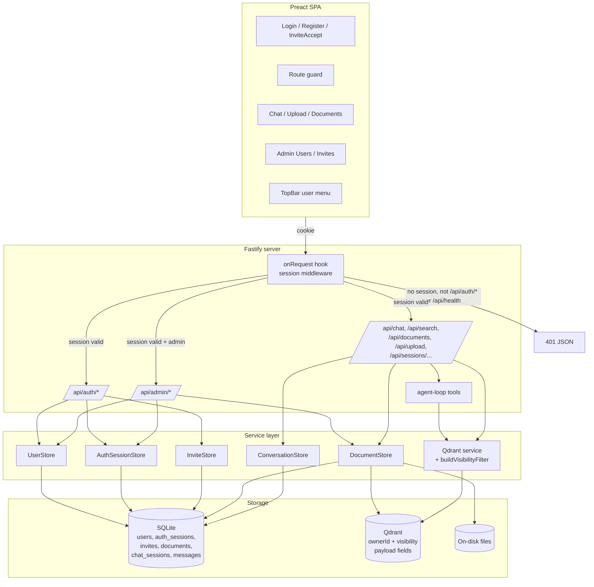
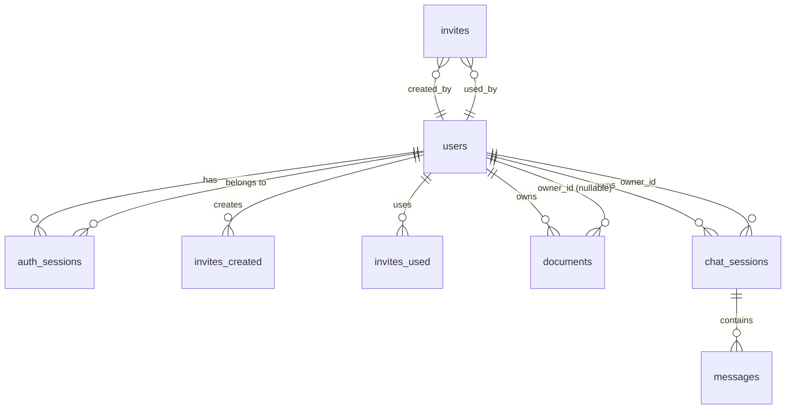
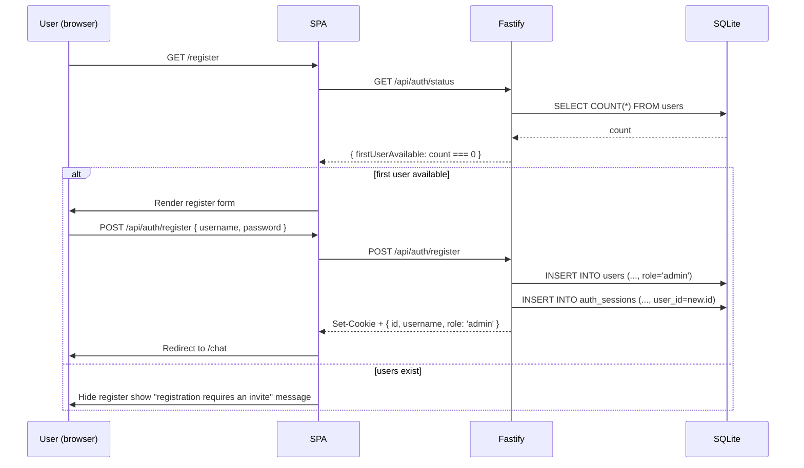
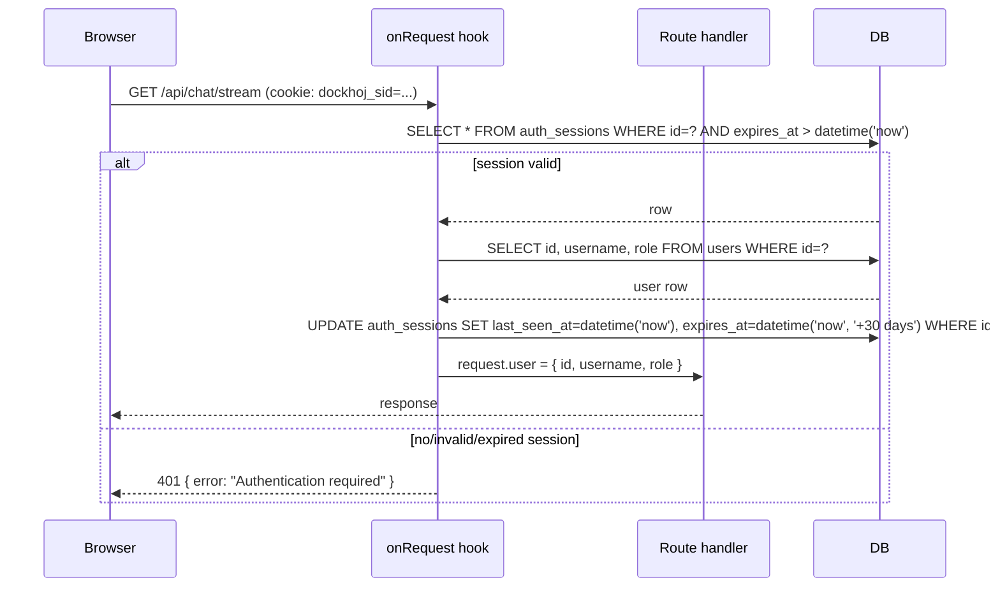
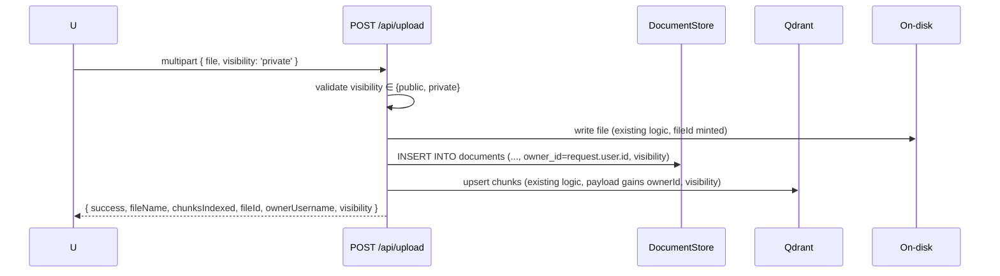
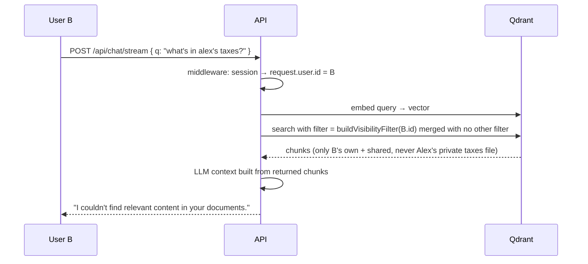
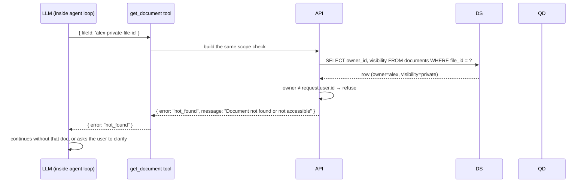

# Phase 04 — Design

## Architecture overview

Phase 04 inserts an **auth + ownership layer** between every existing API route and its current logic. The shape:



The middleware is the single chokepoint: every request that doesn't terminate at `/api/auth/*` or `/api/health` must have a valid session, or it's a 401. Everything downstream reads `request.user.id` to scope DB + Qdrant queries.

## Tech stack additions
- **`argon2`** — password hashing. Native module; OWASP-recommended parameters. If the native build fails on the Docker image (Alpine + Node 20), the implementation falls back to **`bcrypt`** with `cost = 12` (both produce a hash of the same shape — `algorithm$params$salt$hash` — so we can swap without changing the schema or the verify code path, just the password-verify call). The choice is fixed at implementation time by which builds; documented in the task acceptance criteria.
- **No new infrastructure.** Everything fits inside the existing SQLite + Qdrant + Fastify stack.

## Module / package layout

New files:

```
src/
  db/migrations/
    005_users.sql                  -- users + auth_sessions + invites tables
    005_documents_owner.sql        -- documents.owner_id + visibility
    005_documents_owner_qdrant.sql -- (data migration) Qdrant payload backfill
    006_chat_sessions_owner.sql    -- chat_sessions.owner_id + delete legacy rows
  services/
    user-store.ts        -- UserStore: createUser, findByUsername, updateLastLogin, etc.
    auth-session-store.ts -- AuthSessionStore: create, find, touch, deleteByUser, deleteById
    invite-store.ts      -- InviteStore: create, findByTokenHash, markUsed, list, delete
    password.ts          -- hashPassword + verifyPassword (argon2id / bcrypt wrapper)
    auth.ts              -- Fastify plugin: register + decorate + onRequest hook
  routes/
    api-auth.ts          -- POST /api/auth/{register,login,logout,invite/accept}; GET /api/auth/{me,status}
    api-admin.ts         -- POST/GET/DELETE /api/admin/invites; GET/DELETE /api/admin/users; POST /api/admin/users/:id/password
    api-health.ts        -- (existing, unchanged)
    api-documents.ts     -- (modified: FR-34/35/36)
    upload.ts            -- (modified: FR-27/28)
    download.ts          -- (modified: FR-36)
    search.ts            -- (modified: FR-38)
    chat.ts              -- (modified: FR-38)
    chat-stream.ts       -- (modified: FR-38)
    api-sessions.ts      -- (modified: FR-42/43/44)

web/src/
  routes/
    Login.tsx
    Register.tsx
    InviteAccept.tsx
    AdminUsers.tsx
    AdminInvites.tsx
  hooks/
    useAuth.ts           -- reads /api/auth/me, exposes {user, login, logout, register}
  components/
    RouteGuard.tsx       -- <RouteGuard><Page/></RouteGuard> wrapper for auth-gated pages
    UserMenu.tsx         -- TopBar dropdown with username + logout + admin links
    VisibilityToggle.tsx -- Public / Private radio for the upload form
  services/
    auth.ts              -- login(), logout(), register(), acceptInvite(), fetchMe()
    admin.ts             -- listUsers, deleteUser, resetPassword, listInvites, createInvite, revokeInvite

tests/
  services/
    user-store.test.ts
    auth-session-store.test.ts
    invite-store.test.ts
    password.test.ts
    qdrant-visibility.test.ts   -- cross-user filter behavior
  routes/
    api-auth.test.ts
    api-admin.test.ts
    api-documents-auth.test.ts  -- scoped list / delete
    api-search-auth.test.ts     -- filter applied
    chat-stream-auth.test.ts    -- filter applied
```

## Data model

### SQLite schema

**`users`**

| Column           | Type   | Notes                                                                 |
| ---------------- | ------ | --------------------------------------------------------------------- |
| `id`             | TEXT PK | UUIDv4.                                                                |
| `username`       | TEXT NOT NULL UNIQUE | 3–32 chars, `[A-Za-z0-9_-]+`, case-sensitive.                |
| `password_hash`  | TEXT NOT NULL | argon2id or bcrypt; verify by `$`-splitting the algorithm prefix.       |
| `role`           | TEXT NOT NULL | `'admin'` or `'user'`. CHECK constraint.                              |
| `created_at`     | TEXT NOT NULL DEFAULT (datetime('now')) |                                                                  |
| `last_login_at`  | TEXT   | Nullable until first login.                                           |

**`auth_sessions`** (distinct from `chat_sessions` — the existing `sessions` table is renamed conceptually to `chat_sessions` in this phase's docs, but the physical table name stays `sessions` to keep the migration delta small)

| Column        | Type   | Notes                                                       |
| ------------- | ------ | ----------------------------------------------------------- |
| `id`          | TEXT PK | 32-byte URL-safe base64 random.                             |
| `user_id`     | TEXT NOT NULL | FK → `users.id` ON DELETE CASCADE.                          |
| `created_at`  | TEXT NOT NULL DEFAULT (datetime('now')) |                                                 |
| `last_seen_at`| TEXT NOT NULL DEFAULT (datetime('now')) | Updated on every authenticated request.                     |
| `expires_at`  | TEXT NOT NULL | `last_seen_at + 30 days`.                                  |

Index: `idx_auth_sessions_user` on `(user_id)` for "list my sessions" / "force-logout all of user X".

**`invites`**

| Column        | Type   | Notes                                                       |
| ------------- | ------ | ----------------------------------------------------------- |
| `id`          | TEXT PK | UUIDv4.                                                     |
| `token_hash`  | TEXT NOT NULL UNIQUE | SHA-256 of the raw token (base64). Raw token never stored. |
| `created_by`  | TEXT NOT NULL | FK → `users.id` ON DELETE CASCADE.                          |
| `created_at`  | TEXT NOT NULL DEFAULT (datetime('now')) |                                                 |
| `expires_at`  | TEXT NOT NULL | `created_at + N days` (default 7).                          |
| `used_by`     | TEXT   | FK → `users.id` ON DELETE SET NULL. Nullable until used.    |
| `used_at`     | TEXT   | Nullable until used.                                        |

Index: `idx_invites_token_hash` on `token_hash` (UNIQUE already covers it).

**`documents` (after migration 005)**

Adds two columns:

| Column       | Type   | Notes                                                                 |
| ------------ | ------ | --------------------------------------------------------------------- |
| `owner_id`   | TEXT   | FK → `users.id` ON DELETE SET NULL. Nullable.                        |
| `visibility` | TEXT NOT NULL DEFAULT 'public' | `'public' | 'private'`. CHECK constraint.             |

Index: `idx_documents_owner` on `(owner_id)`. Legacy rows get `owner_id = NULL, visibility = 'public'`.

**`sessions` (chat sessions, after migration 006)**

Adds one column:

| Column     | Type   | Notes                                                                 |
| ---------- | ------ | --------------------------------------------------------------------- |
| `owner_id` | TEXT   | FK → `users.id` ON DELETE CASCADE. Nullable until first post-Phase-04 chat. |

Migration 006 also `DELETE FROM sessions;` — cascades to `messages` via the existing FK.

### Qdrant payload

Every chunk's payload gains two fields:

| Field        | Type                  | Notes                                       |
| ------------ | --------------------- | ------------------------------------------- |
| `ownerId`    | `string \| null`      | The owning user's id, or null for shared.   |
| `visibility` | `'public' \| 'private'` | Controls cross-user visibility.            |

Payload indexes are added for both fields (keyword schema) via `ensurePayloadIndexes()`.

### Relationships



## API surface

All endpoints return JSON `{ "error": "..." }` on failure. 401 / 403 / 404 / 410 / 422 are the relevant statuses. Successful responses are documented per-endpoint below.

### `/api/auth/*` (unauthenticated, with the exceptions noted)

| Method | Path                         | Body                                         | Response                                                  |
| ------ | ---------------------------- | -------------------------------------------- | --------------------------------------------------------- |
| POST   | `/api/auth/register`         | `{ username, password }`                     | `{ id, username, role }` + cookie. 403 if users exist.    |
| POST   | `/api/auth/login`            | `{ username, password }`                     | `{ id, username, role }` + cookie. 401 on bad creds.      |
| POST   | `/api/auth/logout`           | (empty)                                      | `{ success: true }`. Idempotent; clears cookie.           |
| GET    | `/api/auth/me`               | n/a                                          | `{ id, username, role }` or 401.                          |
| GET    | `/api/auth/status`           | n/a                                          | `{ firstUserAvailable: boolean }`. Lets the SPA's Register page render / hide itself. |
| POST   | `/api/auth/invite/accept`    | `{ token, username, password }`              | `{ id, username, role }` + cookie. 410 on bad token.      |

Cookie set on success: `dockhoj_sid=<session-id>; HttpOnly; SameSite=Lax; Path=/; Max-Age=2592000; Secure` (in production).

### `/api/admin/*` (admin role required)

| Method | Path                                  | Body                       | Response                                                                                  |
| ------ | ------------------------------------- | -------------------------- | ----------------------------------------------------------------------------------------- |
| POST   | `/api/admin/invites`                  | `{ expiresInDays?: number }` | `{ id, token, expiresAt }`. Token is shown ONCE.                                          |
| GET    | `/api/admin/invites`                  | n/a                        | `[{ id, createdBy, createdAt, expiresAt, usedBy, usedAt }, ...]` (excludes the raw token). |
| DELETE | `/api/admin/invites/:id`              | n/a                        | `{ success: true }`. 404 if not found.                                                     |
| GET    | `/api/admin/users`                    | n/a                        | `[{ id, username, role, createdAt, lastLoginAt }, ...]` (excludes password_hash).          |
| DELETE | `/api/admin/users/:id`                | n/a                        | `{ success: true, documentsDeleted: number }`. 400 if `id === request.user.id`.           |
| POST   | `/api/admin/users/:id/password`       | `{ password }`             | `{ success: true }`. Deletes all of that user's auth sessions.                             |

### Modified existing endpoints

| Method | Path                          | Change                                                                                              |
| ------ | ----------------------------- | --------------------------------------------------------------------------------------------------- |
| POST   | `/api/upload`                 | Accepts `visibility` form field (`public\|private`, default `private`). Sets `owner_id` from session. Response includes `ownerUsername`, `visibility`. |
| GET    | `/api/documents`              | Returns `own + shared`. Response shape gains `ownerUsername`, `visibility`.                          |
| DELETE | `/api/documents/:fileId`      | 404 unless `owner_id === request.user.id OR owner_id IS NULL`.                                      |
| GET    | `/api/download/:filename`     | 404 unless the file's owner is the requester or shared.                                             |
| GET    | `/api/search`                 | `buildVisibilityFilter(request.user.id)` applied.                                                   |
| GET    | `/api/search/rag`             | Same.                                                                                               |
| POST   | `/api/chat`                   | Same.                                                                                               |
| POST   | `/api/chat/stream`            | Same (including the agent loop's tool calls).                                                       |
| POST   | `/api/sessions`               | Stamps `owner_id` from session.                                                                     |
| GET    | `/api/sessions`               | Returns only the current user's sessions.                                                           |
| GET    | `/api/sessions/:id`           | 404 unless `owner_id === request.user.id`.                                                          |
| GET    | `/api/sessions/:id/messages`  | Same.                                                                                               |
| PATCH  | `/api/sessions/:id`           | Same.                                                                                               |
| DELETE | `/api/sessions/:id`           | Same.                                                                                               |
| GET    | `/api/status`                 | Now requires auth. `chunks` and `documents` reflect only what the user can see.                    |

### Unchanged (still unauthenticated)

| Method | Path             |
| ------ | ---------------- |
| GET    | `/api/health`    |

### SPA routes

| Path                 | Auth     | Page component       |
| -------------------- | -------- | -------------------- |
| `/login`             | public   | `Login.tsx`          |
| `/register`          | public (hidden after first user) | `Register.tsx` |
| `/register/:token`   | public   | `InviteAccept.tsx`   |
| `/chat`              | required | `Chat.tsx` (existing) |
| `/upload`            | required | `Upload.tsx` (existing, with VisibilityToggle) |
| `/documents`         | required | (redirects to `/upload#documents` for now) |
| `/admin/users`       | required + admin | `AdminUsers.tsx`     |
| `/admin/invites`     | required + admin | `AdminInvites.tsx`   |

## Key algorithms / flows

### First-user signup



### Authenticated request (the middleware)



The `last_seen_at` + `expires_at` update is a single `UPDATE … WHERE id=?` per request. On the hot path this is one extra round-trip; it's amortized into the existing DB connection. Phase 04 does not cache session lookups in-process — the lookup is fast (PK index, single row), and an in-process cache would complicate the "delete user → kill all their sessions" admin flow.

### Visibility filter — applied to every Qdrant query

```ts
// services/qdrant.ts
export function buildVisibilityFilter(viewerId: string): QdrantFilter {
  return {
    must: [
      {
        should: [
          { key: 'visibility', match: { value: 'public' } },
          { key: 'ownerId',     match: { value: viewerId } },
        ],
      },
    ],
  };
}
```

Every existing Qdrant call (`searchChunks`, `deleteByFilePath`, `fetchByFilePathAndIndex`, `fetchByFilePathAndHeadingPath`, `expandHits`'s internal calls) gains a `viewerId` parameter and merges `buildVisibilityFilter(viewerId)` into the existing filter clause. The `searchChunks` call inside the agent loop, and the four agent-tool implementations, all carry the same `viewerId`.

The `deleteByFilePath` call inside `DELETE /api/documents/:fileId` is a special case: it only runs after the route handler verifies the file is deletable by the requester (FR-35). The visibility filter is NOT used as an authorization gate on delete — the route handler does the explicit ownership check first, then deletes.

### Upload with visibility



### Cross-user retrieval attempt (the negative path)



### Agent tool: get_document with a foreign fileId



The filter is enforced server-side. The LLM sees a "not found" — it cannot reason around the filter to access a foreign chunk.

## State management

- **Server-side authoritative.** SQLite is the single source of truth for users, sessions, invites, documents, chat sessions, messages. Qdrant is the source of truth for chunk payloads (including `ownerId` + `visibility`).
- **No in-process caches.** Per the §middleware discussion: simpler, no invalidation problem, lookup is a PK index hit.
- **SPA local state.** `useAuth()` exposes `{ user, status: 'loading'|'authenticated'|'anonymous' }`. Page components re-render when auth status changes (e.g. after logout). `useDocuments` and `useSessions` re-fetch on 401 and trigger `useAuth` to flip to `anonymous`.

## Error handling strategy

| HTTP status | When                                                                              | Response body                                      |
| ----------- | --------------------------------------------------------------------------------- | -------------------------------------------------- |
| 400         | Bad input (e.g. visibility is neither `public` nor `private`, password too short). | `{ error: "<message>" }`                            |
| 401         | Missing or invalid session cookie.                                                | `{ error: "Authentication required" }`             |
| 403         | Authenticated but lacking permission (e.g. register when users exist; non-admin hitting `/api/admin/*`). | `{ error: "<message>" }` |
| 404         | Resource doesn't exist OR caller can't see it (cross-user privacy — same opaque code for both). | `{ error: "Not found" }` |
| 410         | Invite token already used or expired.                                             | `{ error: "Invite expired or already used" }`      |
| 422         | Body validation failed (Zod-equivalent: missing required field, wrong type).      | `{ error: "<message>", field?: "<name>" }`          |
| 500         | Anything unexpected. Logged at ERROR with stack.                                  | `{ error: "Internal server error" }`               |

The "404 for both missing and forbidden" rule (for documents, sessions, and Qdrant retrievals) is the privacy guarantee: a foreign user cannot distinguish "this file doesn't exist" from "this file exists but you can't see it".

## Testing strategy

### Vitest (unit + integration)
- `services/user-store.test.ts` — createUser (first user is admin), findByUsername, updateLastLogin, username uniqueness, password-hash storage.
- `services/auth-session-store.test.ts` — create, find, touch (rolling expiry), deleteByUser, deleteById, expiry semantics.
- `services/invite-store.test.ts` — create (token-hash storage), findByTokenHash, markUsed, list outstanding, single-use.
- `services/password.test.ts` — hash-then-verify round-trip; reject wrong password; reject malformed hash; parameter sensitivity (argon2id defaults if available, bcrypt otherwise).
- `services/qdrant-visibility.test.ts` — using `fastify.inject` against a real Fastify app wired to a (test-only) in-memory Qdrant mock OR a real Qdrant in CI if available. Verifies: user A's private file is invisible to user B's search / chat / tools; user B's public file is visible to user A.
- `routes/api-auth.test.ts` — register (first user only), login, logout, me, invite/accept, status.
- `routes/api-admin.test.ts` — invite CRUD, user CRUD, password reset, self-delete prevention.
- `routes/api-documents-auth.test.ts` — scoped list, scoped delete, 404 on foreign private.
- `routes/api-search-auth.test.ts` — filter applied; foreign private chunks absent from results.
- `routes/chat-stream-auth.test.ts` — filter applied to expand-hits + agent tools.

### E2E (./restart.sh + curl)
- Full smoke walkthrough per the user stories in `requirements.md`:
  1. Register first user → 200 + cookie.
  2. Upload as user A (private).
  3. Register second user via invite → 200 + cookie.
  4. Upload as user B (public).
  5. As user B, search for content from A's private file → empty results.
  6. As user A, search for content from B's public file → finds chunks.
  7. As user A, delete B's public file → success (shared bucket).
  8. As user A, attempt to delete B's private file → 404.
  9. As user A, list invites → empty.
  10. Logout → cookie cleared, /api/auth/me returns 401.

Per the project CLAUDE.md, `./restart.sh` is the integration harness — it rebuilds and brings up the real stack. The vitest suite is for logic that's awkward to hit via curl.

## Deployment / runtime

- **No new env vars.** The existing `.env` is sufficient. (Could add `SESSION_MAX_AGE_DAYS = 30` later; Phase 04 hardcodes it.)
- **No new Docker services.** The auth layer is pure Fastify middleware + SQLite tables.
- **Cookie behavior:**
  - Dev: `Secure` flag OFF (the SPA is HTTP on localhost).
  - Prod: `Secure` flag ON (requires HTTPS — call this out in the README's deployment section).
- **The `argon2` Docker build:** the existing image is Alpine + Node 20. `argon2` compiles natively with `node-gyp`; the build needs `python3`, `make`, and `g++` (already present in `node:20-alpine` via `apk add --no-cache python3 make g++`). If the build fails (it shouldn't, but flagged as a risk), the implementation falls back to `bcrypt`, which has a pure-JS fallback.
- **Observability:**
  - All auth events logged at INFO with `userId` (when known) and `actorUserId`.
  - All 401s logged at INFO with `path` (so brute-force scans surface in logs).
  - All admin actions logged at INFO with `actorUserId` + `targetUserId`.

## Security & privacy

### Threat model
- **Threat 1: Network-reachable server without auth.** Mitigated by FR-20 (every `/api/*` requires auth except auth + health).
- **Threat 2: Cross-user retrieval of private chunks.** Mitigated by FR-32/33/38/39 (visibility filter on every path). Verified by `qdrant-visibility.test.ts`.
- **Threat 3: Session theft via XSS.** Mitigated by `HttpOnly` cookies (no JS access to `dockhoj_sid`).
- **Threat 4: CSRF.** Mitigated by `SameSite=Lax` + same-origin SPA + JSON-only mutating endpoints.
- **Threat 5: Brute-force login.** Not mitigated in Phase 04 (no rate limiting, no lockout). Risk accepted for the self-hosted deployment profile; flagged for future work.
- **Threat 6: Password database leak.** Mitigated by argon2id (or bcrypt as fallback). Neither algorithm is reversible at any reasonable cost.
- **Threat 7: Invite link interception.** Mitigated by the link being single-use, expiring in 7 days, and revocable by the admin. The token is stored hashed in the DB; a DB leak doesn't yield usable tokens.

### PII handling
- The only PII collected is `username` and the argon2id password hash. No email, no display name, no profile fields.
- The `last_login_at` column is a timestamp, not a behavioral log.
- No analytics, no tracking, no third-party calls in the auth path.

## Risks & mitigations

| Risk | Likelihood | Impact | Mitigation |
| ---- | ---------- | ------ | ---------- |
| `argon2` native build fails on Alpine Docker image | Low | Medium | Fall back to `bcrypt` with `cost = 12`. Both produce interchangeable hash strings for verification purposes. Fixed at implementation time by which builds cleanly. |
| A Qdrant path is missed during the visibility-filter sweep | Medium | High | Explicit test (`qdrant-visibility.test.ts`) that uploads a private file as A and asserts B cannot retrieve it via search, chat, expand, or any agent tool. Code review checklist item: every PR that adds a Qdrant call must either apply `buildVisibilityFilter` or explicitly justify why not. |
| The Qdrant payload backfill leaves legacy chunks without `ownerId`/`visibility` | Medium | High | The backfill is gated: it scans all points, sets the two fields, and verifies the count of updated points equals the count of points seen. Idempotent (safe to re-run). Verified by a vitest assertion on the count. |
| Login mutation during the rolling-expiry UPDATE causes write contention | Low | Low | `UPDATE auth_sessions WHERE id=?` is a single-row PK update; SQLite serializes writes but the row is touched once per request — throughput is fine for self-hosted scale (a few users, a few RPS). |
| Cookie `Secure` flag disabled in dev leaks session on a non-HTTPS LAN | Low | Medium | Dev is `localhost`. LAN deployments must set `NODE_ENV=production` AND serve over HTTPS for `Secure` to engage. README callout. |
| Admin deletes their own account accidentally | Low | High | FR-16: `id === request.user.id` returns 400. SPA confirms before calling. |
| SPA leaks a route because the route guard is wired to `pathname` and the user types a non-canonical URL | Low | Medium | Guard runs on every render of `<RouteGuard>`; admin pages have an additional `request.user.role === 'admin'` check (server-enforced). |
| `documents.owner_id ON DELETE SET NULL` cascade keeps orphaned shared files but the on-disk file lingers | Low | Low | User deletion also iterates the user's documents and removes the on-disk files (FR-16 step). Test verifies. |

## Implementation order

Each step is a single commit, testable in isolation:

1. **`p4-T01`** — Branch + worktree. Create the spec folder (already done as part of this spec).
2. **`p4-T02`** — Migrations `005_users.sql` (users + auth_sessions + invites) + `005_documents_owner.sql` (documents columns). Verify with the migration runner on a fresh volume.
3. **`p4-T03`** — Qdrant payload backfill helper. One-shot script that scans all points and `set_payload`s `ownerId = null, visibility = 'public'`. Run during server startup (idempotent — checks for existing fields first).
4. **`p4-T04`** — `password.ts` + `UserStore` + `AuthSessionStore` + `InviteStore`. Vitest unit tests.
5. **`p4-T05`** — `auth.ts` Fastify plugin (the onRequest hook + `request.user` decorator). Mount in `index.ts` BEFORE all other route plugins.
6. **`p4-T06`** — `/api/auth/{register, login, logout, me, status}` routes. Vitest + curl smoke.
7. **`p4-T07`** — `/api/admin/{invites, users, password}` routes. Vitest.
8. **`p4-T08`** — `buildVisibilityFilter` + apply to every Qdrant call in `qdrant.ts` (every existing function gets a `viewerId` parameter; the public callers pass `request.user.id`). Add `ownerId` + `visibility` payload indexes via `ensurePayloadIndexes`.
9. **`p4-T09`** — Update `DocumentStore` to read/write `owner_id` + `visibility`. Update `POST /api/upload` to accept the form field and stamp `owner_id`.
10. **`p4-T10`** — Update `GET /api/documents` + `DELETE /api/documents/:fileId` + `GET /api/download/:filename` for scoping. Add `ownerUsername` + `visibility` to the response shape.
11. **`p4-T11`** — Update `/api/search`, `/api/search/rag`, `/api/chat`, `/api/chat/stream` to thread `viewerId` through to Qdrant calls (including expand-hits and the agent tool's fetch helpers).
12. **`p4-T12`** — Update agent tools (`get_neighbor_chunks`, `get_section_chunks`, `get_chunk`, `get_document`) to apply the visibility filter.
13. **`p4-T13`** — Cross-user retrieval test (`qdrant-visibility.test.ts` + the curl walkthrough from §Testing strategy).
14. **`p4-T14`** — Migration `006_chat_sessions_owner.sql` + delete legacy rows. Update `ConversationStore` to read/write `owner_id`. Update all `/api/sessions*` routes for ownership scoping.
15. **`p4-T15`** — `GET /api/status` requires auth + returns user-scoped counts.
16. **`p4-T16`** — SPA: `useAuth` hook + `auth.ts` service + `Login.tsx` + `Register.tsx` + `InviteAccept.tsx` + `RouteGuard.tsx`.
17. **`p4-T17`** — SPA: `UserMenu` (top bar) + logout wiring. `App.tsx` route guard wiring for `/chat`, `/upload`, `/admin/*`.
18. **`p4-T18`** — SPA: `VisibilityToggle` on the upload form. `DocumentsList` gets owner + visibility columns and the scoped delete button.
19. **`p4-T19`** — SPA: `AdminUsers.tsx` + `AdminInvites.tsx`.
20. **`p4-T20`** — `.env.example` + `README.md` updates (auth section, deployment HTTPS callout, the "Behavior changes from Phase 03 → Phase 04" section).
21. **`p4-T21`** — Final E2E walkthrough via `./restart.sh` + curl per the user stories. Update `docs/architecture.md` if it exists (it doesn't today; Phase 04 doesn't create it).

Each step ends with: `./restart.sh` (clean rebuild + smoke) AND `npm test -- --run`. Per CLAUDE.md §3, no commit without both passing.

## Open decisions

These are choices made in the design that the user may want to override during review. They are NOT open questions in the blocking sense — the design commits to them — but they're flagged so the user can flip them if they want.

- **OD-1.** `argon2` vs `bcrypt`. **Committed to: argon2id.** Fallback to bcrypt if the native build fails. Both are acceptable; the user may have a preference.
- **OD-2.** Username vs email as the login identifier. **Committed to: username.** No email field; no SMTP; no password reset flow.
- **OD-3.** First-user-becomes-admin vs always-admin. **Committed to: first user is admin; subsequent signups require invite.** Per the user's design answer.
- **OD-4.** When a user is deleted, their public-marked files become shared (`owner_id` set to NULL) or are deleted along with their private files? **Committed to: public files become shared.** The user's `team-handbook.md` survives even after Alex is fired.
- **OD-5.** SPA default route when unauthenticated. **Committed to: redirect to `/login?next=<original-path>`** (rather than a "you are not logged in" page that doesn't bounce back).
- **OD-6.** Pre-Phase-04 conversations: deleted vs kept-as-legacy. **Committed to: deleted** per the user's design answer.
- **OD-7.** Account lockout after N failed logins. **Committed to: not in Phase 04.**
- **OD-8.** CSRF tokens. **Committed to: not in Phase 04** (relying on `SameSite=Lax` + same-origin + JSON-only).
- **OD-9.** Username rename by users themselves. **Committed to: not in Phase 04.** Admin can rename in a future task.
- **OD-10.** Branch + worktree isolation. **Committed to: `phase/04-user-accounts-and-private-knowledge` branch + worktree.** Per CLAUDE.md §3 + the size of this phase.