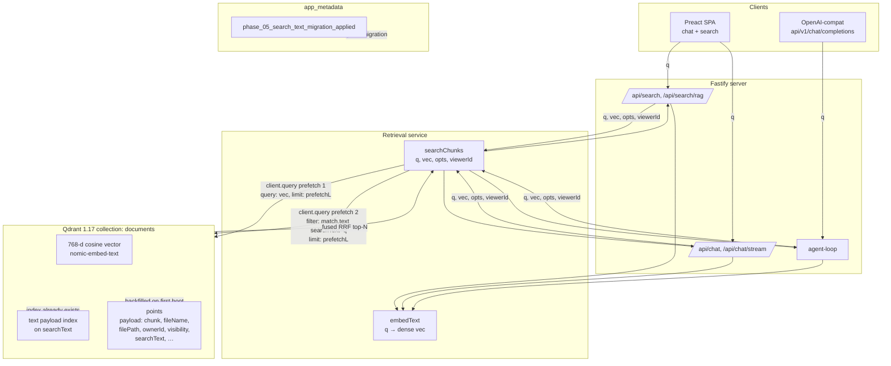

# Phase 05 — Design

## Architecture overview

Phase 05 swaps the retrieval call from a single dense cosine query to a two-prefetch hybrid query, fused by Qdrant-native RRF. The structural change is one method (`searchChunks`); the data change is one new payload field + one new payload index + one backfill migration.



The dotted edges describe **state setup**, not runtime flow: the `text` index is created on collection init; the `searchText` payload is backfilled on first boot after upgrade; the migration flag lives in the existing `app_metadata` collection Phase 04 introduced.

## Tech stack
- **No new dependencies.** The `@qdrant/qdrant-js` SDK (already at `^1.17.0`) supports `prefetch: […]` and `query: { fusion: 'rrf' }` since v1.5. The Qdrant 1.17 server supports `field_schema: 'text'` payload indexes (and full-text `match: { text: <query> }` filters) for years.
- **No new infrastructure.** Same Fastify + Ollama + Qdrant stack.

## Module / package layout

Touched files only — no new files:

```
src/services/qdrant.ts
  • DOCUMENTCHUNKPAYLOAD     -- add optional `searchText?: string`
  • initCollection           -- unchanged
  • ensurePayloadIndexes     -- add one `field_schema: 'text'` entry for searchText
  • migratePayloads          -- left intact; the new migration lives in its own helper
  • migrateSearchTextPayloads-- NEW: mirrors migratePayloads() for the new field
  • upsertChunk              -- set searchText = payload.chunk on the point
  • upsertChunks             -- same, per chunk in the bulk path
  • searchChunks             -- swap single query: for prefetch:[] + query: { fusion: 'rrf' }

src/routes/search.ts         -- pass `query: q` into searchChunks opts (×2)
src/routes/chat.ts           -- pass `query: q` into searchChunks opts (×1)
src/services/stream-chat.ts  -- pass `query: params.question` (×1)
src/services/agent-loop.ts   -- pass `query: params.question` (×1)

src/index.ts                 -- call migrateSearchTextPayloads() after migratePayloads()

tests/services/qdrant.test.ts            -- new test: prefetch shape + rrf fusion + lexical prefetch filter
tests/services/qdrant-visibility.test.ts -- unchanged; still passes via the query:-optional fallback
tests/services/stream-chat.test.ts       -- update toHaveBeenCalledWith expectation for new query field
tests/services/agent-loop.test.ts        -- unchanged; the DI mocks ignore args
tests/test-helpers.ts                    -- update mock signature to match new contract
tests/routes/search.test.ts              -- update call expectations
tests/routes/search-auth.test.ts         -- update call expectations
tests/services/qdrant-migration.test.ts  -- add a sibling test that asserts the new flag is honored
```

The test diffs are the longest single block of changes, but they are mechanical (call signature updates). No test logic is rewritten.

## Data model

**Qdrant** (no SQLite changes):

- New payload field `searchText: string` on every point in `documents`. Verbatim copy of `chunk`. Set on every upsert (FR-1) and backfilled on every pre-existing point (FR-3).
- New payload index `searchText` of schema `text`. Idempotent — `ensurePayloadIndexes` already swallows "Index already exists" (qdrant.ts:228-232).
- New `app_metadata` flag `phase_05_search_text_migration_applied: <ISO timestamp>`, written by `setMetadata` after the one-shot backfill completes.

**SQLite (`conversations.db`)** — unchanged.

## API surface

**No endpoint, request, or response shape changes.**

Internal signature change in one place:

```ts
// before
export async function searchChunks(
  queryVector: number[],
  opts: SearchOptions = {},
  viewerId?: string,
): Promise<DocumentChunk[]>

// after
export async function searchChunks(
  queryVector: number[],
  opts: SearchOptions & { query?: string } = {},
  viewerId?: string,
): Promise<DocumentChunk[]>
```

`opts.query` is the raw user query string. When present (every real call site), the lexical prefetch runs. When absent (legacy `qdrant-visibility.test.ts` mocks that pre-date Phase 05), `searchChunks` falls back to a single dense prefetch — same behavior as Phase 04.

```ts
export interface SearchOptions {
  limit?: number;
  fileName?: string;
  fileType?: string;
  pageNumber?: number;
  // Phase 05 / p5-T01 / FR-5 — raw user query string for the
  // lexical prefetch. Optional; absence falls back to dense-only.
  query?: string;
}
```

## Key algorithm — the new `client.query` call

```ts
const prefetchLimit = Math.max(opts.limit ?? 5, 10) * 2;

const prefetches: Array<Record<string, unknown>> = [
  // dense cosine prefetch
  { query: queryVector, limit: prefetchLimit },
];

// lexical prefetch — only when we have the raw text
if (typeof opts.query === 'string' && opts.query.length > 0) {
  prefetches.push({
    query: undefined,
    filter: {
      must: [{ key: 'searchText', match: { text: opts.query } }],
    },
    limit: prefetchLimit,
  });
}

const response = await client.query(COLLECTION_NAME, {
  prefetch: prefetches,
  query: { fusion: 'rrf' },
  filter: mergeWithVisibility(buildSearchFilter(opts), viewerId),
  limit: opts.limit ?? 5,
  with_payload: true,
});
```

Why each piece:

- **`prefetchLimit = max(limit, 10) * 2`.** RRF combines two ranked lists; each list needs to be larger than the final cut to avoid ties knocking out good candidates. `* 2` is the conventional over-fetch for a 2-way fusion. The `max(..., 10)` floor keeps small `limit` calls from over-fetching trivially.
- **Dense prefetch has no `filter`.** The visibility clause is applied at the top-level fused step, where Qdrant honors `filter` against the fused candidate set. A chunk that survives RRF and isn't visible to the requester is dropped there. Saves a per-prefetch `mergeWithVisibility` call.
- **Lexical prefetch has no `query:`.** Qdrant treats a filter-only prefetch as "match this payload filter, score by text relevance". The `match: { text: opts.query }` clause is the actual lexical match. (`ponytail:` — confirmed against Qdrant 1.17 docs / server; `query: null` works too but `query: undefined` is what the JS SDK serializes cleanly.)
- **Top-level `query: { fusion: 'rrf' }`.** Native RRF with the default rankConstant=60. No custom scoring math.
- **Top-level `filter`.** Visibility + `fileName` + `fileType` + `pageNumber`. Single clause, applied once to the fused set.
- **`with_payload: true`** preserved so the existing payload-mapping code in `searchChunks` (qdrant.ts:405-413) keeps working unchanged.

## State management
- **Qdrant is the source of truth** for the `text` index. No in-process state to maintain; the index is rebuilt lazily by Qdrant as chunks arrive.
- **The migration flag** lives in the existing `app_metadata` collection (Phase 04). No new collection.
- **No in-memory caches** to invalidate. The dense cosine index is untouched; lexical recall rides on the payload index.

## Error handling strategy
- **Migration failure.** If `migrateSearchTextPayloads()` throws partway, the next boot re-runs from scratch — the flag is only written after the loop completes (`setMetadata` is the last line). Until the flag is set, `searchText` may be missing on some chunks; the dense prefetch still works, the lexical prefetch just won't find them. Search degrades gracefully to Phase 04 behavior, never to a hard error.
- **Migration flag races.** Two boots racing: only one wins because `setMetadata` uses `wait: true` upsert with a deterministic UUID. The loser reads the flag on next read and short-circuits.
- **`client.query` partial failure.** Same as today — Qdrant raises; `searchChunks` rejects; the calling route returns 500 JSON. No new error paths.
- **Missing `opts.query` at a call site.** Falls back to dense-only; no error. The `ponytail:` comment on the fallback documents this as a graceful-degradation, not a bug.

## Testing strategy

Per project `CLAUDE.md` §"End-to-end testing protocol" + §"Vitest — secondary".

### Unit tests (vitest, in-process)

1. **`qdrant.test.ts` — hybrid call shape.** Mock `client.query`; call `searchChunks('hello world', [0.1, 0.2], { limit: 5 })`; assert the captured call has:
   - `prefetch.length === 2`
   - `prefetch[0].query` deep-equals the dense vector
   - `prefetch[1].filter.must[0]` deep-equals `{ key: 'searchText', match: { text: 'hello world' } }`
   - `query: { fusion: 'rrf' }`
   - top-level `filter` contains the visibility should-group
   - top-level `limit === 5`
2. **`qdrant.test.ts` — dense-only fallback.** Call `searchChunks([0.1], { limit: 5 })` (no `query`); assert `prefetch.length === 1` and the lone entry's `query` is the dense vector. Same code path the visibility tests exercise.
3. **`qdrant.test.ts` — `upsertChunks` stamps `searchText`.** Construct a chunk, call `upsertChunks`, capture the points argument; assert each point has `payload.searchText === payload.chunk`.
4. **`qdrant-migration.test.ts` sibling — `migrateSearchTextPayloads` happy path + idempotency.** Mock `scroll` and `setPayload`; assert that points missing `searchText` get it set and the flag is written exactly once. Re-run with the flag pre-set; assert no `setPayload` calls.

### Integration / e2e (curl, per `CLAUDE.md`)

5. **Hybrid recall walkthrough.**
   ```bash
   ./restart.sh                                # cold boot
   # log in (use a curl helper that posts /api/auth/login, stores the cookie)
   echo 'DOCKHOJ_HYBRID_TOKEN_7d4f9b8' > /tmp/dockhoj-hybrid-probe.md
   curl -b cookies.txt -F file=@/tmp/dockhoj-hybrid-probe.md \
       http://localhost:3001/api/upload        # ingest
   curl -b cookies.txt \
       'http://localhost:3001/api/search?q=DOCKHOJ_HYBRID_TOKEN_7d4f9b8' | jq '.results[0].fileName'
   # → "/tmp/dockhoj-hybrid-probe.md"
   ```
   The pre-Phase-05 baseline would have failed this assertion (no cosine path for a random hex token); with hybrid the lexical prefetch surfaces it.

6. **Semantic recall unchanged.**
   Upload a PDF whose introduction discusses "the central nervous system"; ask `/api/search?q=summary of the introduction`; expect the introduction chunk top. (Pins that dense recall is unchanged in relative ranking.)

7. **Per-file deletion still clean.**
   After the probe file is deleted via `/api/documents/:id/delete`, re-run the hybrid search; expect zero results. The lexical index entry for that file's chunks is gone along with the points.

8. **No new warnings on the migration flag.** After the second `./restart.sh`, `docker logs dockhoj-app | grep migration` shows "Qdrant searchText migration already applied" (matching the Phase 04 `migratePayloads` log style).

## Deployment / runtime
- **No env vars changed.** `.env.example` unchanged.
- **Dockerfile / docker-compose unchanged.**
- **Migration order.** On boot, `index.ts` calls `initCollection` → `migratePayloads` → `migrateSearchTextPayloads`. The Phase 04 flag must win first because the lexical migration depends on `ownerId` / `visibility` being present on every point (the lexical prefetch is filtered by them). Phase 05 sits after Phase 04.
- **Observability.** One new info log line per first-boot migration run ("Qdrant searchText migration complete", with `{ scanned, updated }`). Subsequent boots log "already applied". Same shape as `migratePayloads`.
- **Rollback.** `git revert` of the Phase 05 commits is safe. `searchText` becomes dead data on disk; the dense-only `client.query` call works without it. Optional follow-up: a one-liner cleanup script that strips `searchText` from every point (out of scope for this phase).

## Security & privacy
- **Visibility scope.** The top-level fused `filter` carries the same `mergeWithVisibility(viewerId)` clause Phase 04 wired. Lexical recall cannot leak a private chunk that visibility scoping would deny.
- **No new trust surface.** No new external services, no new ports, no new auth checks.
- **No PII in payloads.** `searchText` is a verbatim copy of `chunk`, which is the same text already stored in the payload (visible to anyone with Qdrant read access). No expansion of sensitive data.

## Risks & mitigations

| Risk | Likelihood | Mitigation |
|---|---|---|
| Qdrant server doesn't actually support `{ fusion: 'rrf' }` on this version | Low — 1.17 has had this since 1.5 | `client.query` will throw with a descriptive error at first call; tests catch this immediately. Pinning a `QDRANT_VERSION` env in `.env.example` is out of scope but trivial to add later. |
| Migration on a very large corpus blocks boot for minutes | Low — `scroll + setPayload` per 100 points is incremental; the existing `migratePayloads` is the template | Same shape as Phase 04, which already ships with this property. `MIGRATION_SCAN_BATCH = 100`. |
| Text payload index slows down upsert path | Low — Qdrant builds the index incrementally on the next scroll; `ensurePayloadIndexes` blocks until the index is ready | Already the pattern. `ponytail:` log line on creation; `wait: true` makes the call deterministic. |
| `searchText` field grows payload size | Trivial — same string as `chunk`, just a second copy in the payload | Could later drop `chunk` from the payload and derive it on retrieval, but that's a payload-shape change for a different phase. For now, ~10-30% payload overhead per point is fine for the corpus size. |
| Random hex token in a probe doc is accidentally in some other document | Trivial — the e2e walkthrough uses a UUID-derived token that's globally unique | One-time probe; documented in `design.md`. |

## Implementation order

The whole phase is one working diff, but ordered for smallest-reviewable changes:

1. **T1. Schema + index + backfill** — `searchText` payload field, `text` index, `migrateSearchTextPayloads`. Idempotent. `qdrant-migration.test.ts` sibling test. No behavior change yet (the upsert path is updated but `searchChunks` is untouched in T1; the field is dead data until T2).
2. **T2. Hybrid `searchChunks`** — swap the single `query:` for `prefetch:[] + query:{fusion:'rrf'}`; add the optional `query` field on `SearchOptions`. Unit test pins call shape. Stream-chat / chat / search / agent-loop call sites thread `query`. Visibility tests untouched (dense-only fallback path).
3. **T3. E2E walkthrough** — `./restart.sh` cold boot, ingest probe doc, assert lexical recall, assert semantic recall, assert deletion cleanliness, assert migration flag set on second boot. No code changes; just the protocol from `CLAUDE.md` executed against the running stack.

Each step is testable in isolation; T1 is reversible by deleting the field + index, T2 by reverting `searchChunks`.