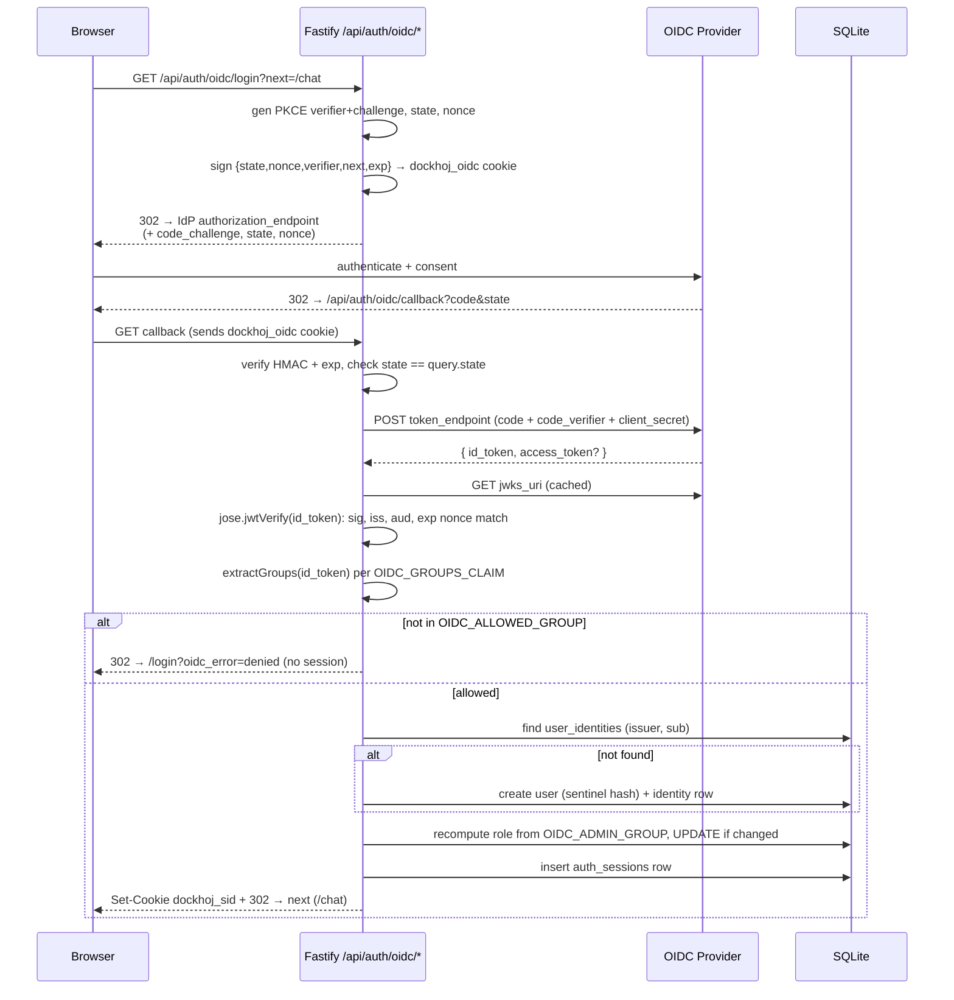

# Phase 06 — Design: OIDC (custom provider) login

> Implements `requirements.md`. Ponytail `full` was applied to every
> code-bearing decision below; the ladder (stdlib → native → installed dep →
> new dep) is walked explicitly where it matters. Decisions not bearing code
> (flows, threat model) are shaped purely by the requirements.

## Architecture overview

OIDC is an **additive** login path that reuses the Phase-04 cookie-session
substrate. It only changes *how the user row is resolved* (find-or-create by
OIDC identity instead of password verify); the session cookie, the
`auth_sessions` table, and the `request.user` middleware are untouched.



The three boundaries from `docs/architecture.md` are preserved: the
**trust boundary** (the callback is public, under `/api/auth/*`), the
**retrieval boundary** (OIDC users get an `ownerId` like anyone else), and the
**persistence boundary** (identities in SQLite, no tokens persisted).

## Tech stack (ponytail-walked)

| Need | Choice | Ladder rung / why |
|---|---|---|
| JWT/JWKS verify | **`jose`** (new dep, MIT) | Rung 5b. Node stdlib *can* verify RS256/ES256 (`crypto.createPublicKey` + `crypto.verify`), but it is ~150 LOC of security-critical crypto (alg-confusion, `none` rejection, kid lookup, timing). §0 + ponytail "pick the edge-case-correct option" both say: hand-rolling JOSE to save one dep is the shortcut §0 rejects. `jose` is the standard, handles JWKS cache+refresh and PKCE helpers. **Only new dep this phase.** |
| HTTP to IdP | global `fetch` (Node 20) | Rung 3. Already the LLM-client transport. |
| PKCE/state/nonce RNG | `jose` `randomPKCECodeVerifier`/`calculatePKCECodeChallenge`/`randomState`/`randomNonce` | Rung 5 (already installed via jose). Keeps base64url-S256 consistent. |
| State-cookie signing | `node:crypto` `createHmac('sha256')` | Rung 3. Key derived from `OIDC_CLIENT_SECRET` (already a per-install secret) — avoids a new env var. |
| `.env` rewrite | stdlib `fs` + a pure string fn | Rung 3. No `dotenv` (the file is hand-curated; we rewrite specific keys only). |
| Interactive prompts | `node:readline` | Rung 3. Mirrors `scripts/reset-admin-account.ts`. |
| URL parse/build | global `URL` / `URLSearchParams` | Rung 3. |

Net: **one new dependency (`jose`)**, matching Phase 03/04/05's "zero or one
new dep" discipline. Everything else is stdlib.

## Module / package layout

```
src/
  db/migrations/008_oidc_identities.sql      # user_identities table (+comment on sentinel)
  services/
    oidc.ts                                  # config load, discovery cache, JWKS, id_token verify,
                                             #   group extraction, username derivation, state cookie
    user-identity-store.ts                   # (issuer, sub) ↔ user_id CRUD
    cookies.ts                               # EXTRACTED: setSessionCookieHeader + constants
                                             #   (5 callers now → past the inline-repeat YAGNI threshold)
    dotenv-rewrite.ts                        # pure string→string .env key rewriter (testable)
  routes/
    api-auth-oidc.ts                         # GET /api/auth/oidc/login, /api/auth/oidc/callback
  routes/api-auth.ts                         # EDIT: /status gains `oidc` field; use cookies.ts
  services/user-store.ts                     # EDIT: add createOidcUser + updateRole
  index.ts                                   # EDIT: register api-auth-oidc routes
scripts/
  setup-oidc.ts                              # the 4-step interactive setup (npm run setup-oidc)
web/src/
  services/auth.ts                           # EDIT: AuthStatus.oidc field
  routes/Login.tsx                           # EDIT: SSO button + ?oidc_error rendering
  styles/auth.css                            # EDIT: button styles
.env.example                                 # EDIT: OIDC section
package.json                                 # EDIT: jose dep + setup-oidc script
```

**Why these files and no more:** each maps to one responsibility and mirrors
an existing convention (a `*-store.ts`, a `routes/api-*.ts`, a `scripts/*.ts`
run via `npm run`). No speculative sub-folders. `cookies.ts` is extracted only
because OIDC is the 5th caller of the cookie helper — the existing
`ponytail:` comment in `api-auth.ts` named 4 as the YAGNI threshold; this
phase crosses it, so extraction is now justified (and DRY).

## Data model

### Migration `008_oidc_identities.sql`

```sql
-- Phase 06 / p6-T0X: OIDC identity linking.
-- One row per (issuer, sub) pair seen at login. The local users.id it
-- points at is always an OIDC-provisioned user (password_hash holds the
-- '!oidc!' sentinel — see user-store createOidcUser). Local password
-- accounts never appear here; account-merging is out of scope.

CREATE TABLE IF NOT EXISTS user_identities (
  id           TEXT PRIMARY KEY,
  user_id      TEXT NOT NULL,
  issuer       TEXT NOT NULL,
  sub          TEXT NOT NULL,
  created_at   TEXT NOT NULL DEFAULT (datetime('now')),
  last_seen_at TEXT NOT NULL DEFAULT (datetime('now')),
  FOREIGN KEY (user_id) REFERENCES users(id) ON DELETE CASCADE
);

-- The lookup path: at callback time we SELECT ... WHERE issuer=? AND sub=?.
CREATE UNIQUE INDEX IF NOT EXISTS idx_user_identities_issuer_sub
  ON user_identities (issuer, sub);

-- Cascade helper: when a user is deleted, drop their identities too.
CREATE INDEX IF NOT EXISTS idx_user_identities_user_id
  ON user_identities (user_id);
```

### Sentinel password hash (OQ-3 — decided)

`users.password_hash` is `NOT NULL` (Phase 04). SQLite **cannot drop a NOT NULL
constraint** without a table rebuild (`CREATE TABLE _new … INSERT … DROP …
RENAME`), which is risky against a live users table. The ponytail choice:

- OIDC-provisioned users store `password_hash = '!oidc!'`.
- `verifyPassword(plain, '!oidc!')` already returns `false` — the stored
  value isn't in the `scrypt$…` format, so the format check fails before any
  comparison. No special-case needed; OIDC users **cannot** password-login by
  construction.
- The `user_identities` row is the authoritative link; the sentinel just
  means "no password."
- Ceiling: the sentinel is a magic string. Mitigated by a single `OIDC_PASSWORD_SENTINEL = '!oidc!'` constant in `user-store.ts` and a `// why:` comment. If a future phase wants real nullable hashes, the table rebuild happens then with a clean migration.

This avoids a destructive migration on Phase-04 data for a one-line
convention — the smaller, safer diff.

## API surface

All routes are under `/api/auth/`, so the existing `isPublic()` check in
`src/services/auth.ts` (`url.startsWith('/api/auth/')`) already exempts them
— **no middleware change needed**.

### `GET /api/auth/oidc/login?next=<path>` → 302 (FR-13)

- **Query:** `next` — optional relative path, defaults `/chat`. Validated:
  must start with `/` and not `//` (no open-redirect / protocol-relative).
  Invalid → coerced to `/chat`.
- **Effect:** generate `code_verifier` (PKCE), `code_challenge = S256(verifier)`,
  `state`, `nonce`. Build a signed `dockhoj_oidc` cookie (see "State cookie"
  below). 302 to `authorization_endpoint` with:
  `response_type=code`, `client_id`, `redirect_uri=<APP_BASE_URL>/api/auth/oidc/callback`,
  `scope=<OIDC_SCOPES>`, `state`, `nonce`, `code_challenge`, `code_challenge_method=S256`.
- **Errors:** if OIDC config is missing/incomplete → 503 JSON
  `{ error: 'OIDC not configured' }` + warn log.

### `GET /api/auth/oidc/callback?code=<code>&state=<state>` → 302 (FR-14..17)

- Reads the `dockhoj_oidc` cookie, verifies HMAC + `exp`, checks `state`
  matches the query. Mismatch/missing/expired → 302 to
  `/login?oidc_error=state`.
- `POST token_endpoint` with `grant_type=authorization_code`, `code`,
  `redirect_uri`, `client_id`, `code_verifier`, and client auth (see
  "Token-endpoint auth"). Network/non-2xx → `/login?oidc_error=exchange`.
- `jose.jwtVerify(id_token, JWKS, { issuer, audience: client_id, algorithms: [...] })`
  — checks signature, `iss`, `aud`, `exp`, `iat`. Then manual `nonce` check
  against the cookie. Failure → `/login?oidc_error=token`.
- `extractGroups(payload)` → membership check against `OIDC_ALLOWED_GROUP`.
  Not a member → `/login?oidc_error=denied` (**no user created, no cookie
  set** — this is FR-8's "403" honored as "session refused"; the browser
  delivery is the redirect per FR-17, since a raw 403 would render JSON).
- Find-or-create user (FR-10/11), recompute role (FR-9), insert `auth_sessions`
  row, set `dockhoj_sid` cookie (same attributes as password login), 302 to
  validated `next`.

### `GET /api/auth/status` (FR-19 — edited)

Returns the existing `{ firstUserAvailable }` **plus**:

```json
{ "firstUserAvailable": false, "oidc": { "enabled": true, "providerName": "Authelia" } }
```

`enabled` is true iff `loadOidcConfig()` returns non-null. `providerName` =
`OIDC_PROVIDER_NAME` if set, else the `issuer` host. When disabled,
`oidc = { enabled: false, providerName: '' }`.

## Key algorithms / flows

### Config loading (`src/services/oidc.ts` — `loadOidcConfig()`)

```ts
// ponytail: one typed object, computed once per request from env. Returns
// null when OIDC is off OR misconfigured — the rest of the app treats null
// as "no OIDC", so a half-configured install degrades to password-only
// instead of crashing logins.
type OidcConfig = {
  clientId: string; clientSecret: string; issuer: string;
  discoveryUrl: string; scopes: string; groupsClaim: string;
  allowedGroups: string[]; adminGroups: string[]; providerName: string;
  tokenAuthMethod: 'client_secret_post' | 'client_secret_basic';
  redirectUri: string; // APP_BASE_URL + '/api/auth/oidc/callback'
};
// enabled iff OIDC_ENABLED === 'true' AND clientId+clientSecret+issuer+discoveryUrl all present.
// missing-but-enabled → warn log + return null.
```

### Discovery + JWKS caching

```ts
// ponytail: lazy fetch + in-memory cache, no TTL sweep. Re-fetched on a
// fetch error or jose's key-not-found (kid rotation). Ceiling: a long-lived
// process keeps the first doc forever if the IdP never rotates and never
// errors — acceptable, jose refreshes the JWKS on kid-miss regardless.
let discoveryCache: { doc: DiscoveryDoc; fetchedAt: number } | null = null;
const JWKS_CACHE = new Map<string /* discoveryUrl */, RemoteJWKSet>(); // jose's createRemoteJWKSet caches itself
```

- Discovery doc fetched lazily on first `/login`, cached for the process.
  Re-fetched if older than 1h **or** the previous fetch threw.
- JWKS via `jose.createRemoteJWKSet(new URL(jwks_uri))` — jose caches keys
  internally and re-fetches on unknown `kid`. One `RemoteJWKSet` per
  discovery URL (supports the multi-IdP future without a migration).

### id_token verification (FR-15 / NFR-3)

```ts
const { payload } = await jwtVerify(idToken, getJwks(cfg), {
  issuer: cfg.issuer,
  audience: cfg.clientId,
  // ponytail: pin algorithms — harden against 'none' / alg-confusion (RS256
  // key abused as HS256). List the algorithms we actually expect IdPs to use.
  algorithms: ['RS256', 'RS384', 'RS512', 'ES256', 'ES384', 'ES512', 'EdDSA'],
  requiredClaims: ['iss', 'aud', 'exp', 'iat', 'sub'],
});
if (payload.nonce !== storedNonce) throw new Error('nonce mismatch');
```

`jose` enforces `exp`/`iat`/`aud`/`iss`; nonce is app-specific so checked
manually. On any throw → `/login?oidc_error=token`.

### Group extraction + membership (FR-7/8/9 / NFR-5)

```ts
function extractGroups(payload: JWTPayload, claim: string): string[] {
  const v = payload[claim];
  if (Array.isArray(v)) return v.filter((x): x is string => typeof x === 'string').map((s) => s.trim());
  if (typeof v === 'string') return v.split(',').map((s) => s.trim()).filter(Boolean);
  return []; // claim missing or wrong shape → empty → denied if a gate is set
}
const isMember = (groups: string[], allowed: string[]) =>
  allowed.length === 0 ? true : allowed.some((g) => groups.includes(g));
// gate:   isMember(groups, cfg.allowedGroups) — false → denied
// role:   isMember(groups, cfg.adminGroups)   ? 'admin' : 'user'
```

Blank `OIDC_ALLOWED_GROUP` (empty array) = no gate (UC-2 default). Case-
sensitive, trimmed comparison.

### Username derivation (FR-11)

```ts
// candidate preference: preferred_username → email local-part → sub.
function deriveCandidate(p: JWTPayload): string {
  if (typeof p.preferred_username === 'string' && USERNAME_RE.test(p.preferred_username)) return p.preferred_username;
  if (typeof p.email === 'string') {
    const local = p.email.split('@')[0] ?? '';
    const slug = local.replace(/[^A-Za-z0-9_-]/g, '').slice(0, 32);
    if (USERNAME_RE.test(slug)) return slug;
  }
  return 'oidc-' + String(p.sub ?? '').replace(/[^A-Za-z0-9_-]/g, '').slice(0, 26);
}
// then de-dup: try candidate; on collision (usernameExists), append 2,3,… until free.
```

`USERNAME_RE = /^[A-Za-z0-9_-]{3,32}$/` (reused from `user-store.ts`). The
de-dup loop is O(n) in colliding usernames — ponytail ceiling noted; n is tiny
in practice.

### State cookie (OQ-1 — decided: signed HMAC, stateless)

```ts
type OidcState = { state: string; nonce: string; verifier: string; next: string; exp: number };
// key = createHmac('sha256', 'dockhoj-oidc-state-v1').update(clientSecret).digest();
// cookie value = base64url(JSON.stringify(state)) + '.' + base64url(hmac(payload))
function signState(s: OidcState, clientSecret: string): string;
function verifyState(cookie: string, clientSecret: string): OidcState | null; // null on bad hmac / exp
```

Cookie attrs: `dockhoj_oidc`, HttpOnly, `SameSite=Lax` (required so the IdP's
top-level redirect back to `/callback` carries it — Lax permits cookies on
cross-site GET navigations, exactly this case), Path=/, Max-Age=300 (5 min),
Secure in production. Cleared on successful callback.

Why stateless: no DB sweep, no new table, survives restart. The HMAC key
derived from `OIDC_CLIENT_SECRET` means rotating the secret invalidates
in-flight logins (acceptable — retry).

### Token-endpoint client auth (OQ-2 — decided)

```ts
const authMethod = cfg.tokenAuthMethod; // default 'client_secret_post'
const body = new URLSearchParams({ grant_type: 'authorization_code', code, redirect_uri, client_id, code_verifier });
const headers: Record<string,string> = { 'Content-Type': 'application/x-www-form-urlencoded' };
if (authMethod === 'client_secret_basic') {
  headers.Authorization = 'Basic ' + Buffer.from(`${client_id}:${clientSecret}`).toString('base64');
} else {
  body.set('client_secret', clientSecret);
}
const tok = await fetch(cfg.tokenEndpoint, { method: 'POST', headers, body });
```

Default `client_secret_post` (most IdPs accept it); `OIDC_TOKEN_ENDPOINT_AUTH_METHOD=client_secret_basic`
for the IdPs that require the header. A 3-line branch for a real
interoperability gap — not speculative.

### Find-or-create + role recompute (FR-10/12, FR-9)

```ts
// one transaction: find identity → create user+identity if missing → set role
db.transaction(() => {
  let userId = identities.findUserIdByIssuerSub(issuer, sub);
  if (!userId) {
    const user = users.createOidcUser({ username: dedupedUsername, role: computedRole });
    identities.link(user.id, issuer, sub);
    return;
  }
  // existing OIDC user: recompute role every login (FR-9)
  users.updateRoleIfChanged(userId, computedRole);
})();
const session = sessions.create(userId);
setSessionCookieHeader(reply, session.id);
```

`computedRole` comes from the group check above. A local admin is never
touched here — `user_identities.user_id` only ever points at OIDC-provisioned
users (no account-merging in this phase).

## Error handling strategy

| Failure | Code/path | User-facing |
|---|---|---|
| OIDC misconfigured at `/login` | 503 JSON | operator fixes `.env` |
| Bad/missing/expired state cookie | 302 `/login?oidc_error=state` | "Sign-in failed, please retry" |
| Token endpoint non-2xx/network | 302 `?oidc_error=exchange` | generic |
| id_token verify fail (sig/iss/aud/exp/nonce) | 302 `?oidc_error=token` | generic (no detail leak) |
| Not in allowed group | 302 `?oidc_error=denied` | "Your account is not permitted" |
| Success | 302 to `next`, session cookie set | lands on `/chat` |

All `oidc_error` codes map to friendly text in the SPA. Server logs (pino)
carry the event + username (never the token/secret) at `info` (success) /
`warn` (denied) / `error` (verify fail).

## Security & privacy (threat model notes)

- **PKCE `S256`** (NFR-1) on every authz — mitigates intercepted `code`.
- **`state`** (CSRF) + **`nonce`** (replay) (NFR-2) — random, single-use,
  ≤5min, HMAC-bound to the server secret.
- **id_token signature verified against JWKS** (NFR-3/FR-15) — never decoded-
  only; alg pinned to defeat `none`/alg-confusion.
- **Client secret** never sent to SPA, never logged, never echoed post-entry
  (NFR-4). Lives in `.env` (gitignored).
- **Open redirect** — `next` validated to a same-origin relative path.
- **Group denial creates no account** (FR-8) — an attacker who can authenticate
  at the IdP but isn't in the group gains no DocKhoj row.
- **PII held:** username + (issuer, sub) + the existing user fields. No token
  persistence. IdP group membership is read ephemerally at login.
- **HTTPS in production** is already a Phase-04 rule; the setup script warns
  on an `http://` base URL (NFR-6).

## State management

- **Server:** discovery doc + JWKS are in-memory caches (process lifetime).
  OIDC login state is the signed cookie (stateless). Sessions stay in
  `auth_sessions` (unchanged).
- **Concurrency:** the find-or-create runs in a SQLite transaction; the
  `UNIQUE(issuer, sub)` index makes a racing double-create surface as a
  constraint error, handled by re-`SELECT` (the second transaction finds the
  row the first committed). Mirrors the invite `markUsed` race handling in
  Phase 04.
- **Persistence:** only `user_identities` + `users.role` updates are new
  writes; everything else reuses existing tables.

## Testing strategy (§2.0 — real behavior, not re-implementations)

### Unit (vitest) — pure logic awkward to hit via curl

- `dotenv-rewrite.test.ts` — `rewriteEnvFile`: append-new-key,
  replace-existing-in-place, preserve-other-lines-and-comments,
  single-trailing-newline, blank-value, line-order-stable. (FR-5)
- `oidc-username.test.ts` — `deriveCandidate` preference order + `USERNAME_RE`
  enforcement; `dedupeUsername` collision suffixing (`alice`→`alice2`→`alice3`).
  (FR-11)
- `oidc-groups.test.ts` — `extractGroups` (array / csv-string / missing /
  mixed-types) + `isMember` (blank-gate-passes, membership, case-sensitivity).
  (FR-7/8/9)
- `oidc-state.test.ts` — `signState`/`verifyState` round-trip + tamper-reject
  + expiry-reject. (NFR-2)

### Integration (vitest + `fastify.inject`) — real JOSE, mocked transport

- Generate an RSA keypair in-test; sign a valid id_token with `jose.SignJWT`.
  Inject `/callback` with a forged-good state cookie → assert user created,
  `dockhoj_sid` set, 302 to `/chat`. (FR-10/16)
- Tamper the id_token signature → 302 `?oidc_error=token`, no session. (FR-15)
- Wrong `iss`/`aud`, expired `exp`, mismatched `nonce` → each rejected. (FR-15)
- Group denial → no `user_identities` row, no cookie, 302 `?oidc_error=denied`.
  (FR-8)
- `/login` sets `dockhoj_oidc` cookie + 302 to the IdP with PKCE params. (FR-13)
- `/status` returns the `oidc` field both enabled and disabled. (FR-19)

The IdP HTTP transport (discovery/token/jwks) is the only thing mocked — via
injecting a fake `fetch` into `oidc.ts` through a thin fetch dependency seam
(the one place we mock: the network boundary, per §2). **id_token crypto is
real** — signed and verified with real keys.

### E2E — `./restart.sh` + curl (the project's integration bar)

- With OIDC **disabled** (default `.env`): `/api/auth/status` →
  `oidc.enabled=false`; password login unchanged; the callback route exists
  but `/login` 302s to the disabled-handler.
- Full IdP E2E is **operator-driven** (UC-1/UC-3 via the setup script against
  a real IdP) — not automatable in CI without a live provider; documented as a
  manual acceptance step in `requirements.md §Acceptance criteria`.

## Deployment / runtime

- **Env vars** (written additively by `scripts/setup-oidc.ts`):

  | Var | Default | Purpose |
  |---|---|---|
  | `OIDC_ENABLED` | `false` | master toggle |
  | `OIDC_ISSUER` | — | from discovery `issuer` |
  | `OIDC_DISCOVERY_URL` | — | `.well-known/openid-configuration` URL |
  | `OIDC_CLIENT_ID` | — | IdP-issued |
  | `OIDC_CLIENT_SECRET` | — | IdP-issued (secret) |
  | `OIDC_SCOPES` | `openid profile email groups` | authz scopes |
  | `OIDC_GROUPS_CLAIM` | `groups` | claim path for group membership |
  | `OIDC_ALLOWED_GROUP` | blank | comma-list; blank = no gate |
  | `OIDC_ADMIN_GROUP` | blank | comma-list mapping to admin role |
  | `OIDC_TOKEN_ENDPOINT_AUTH_METHOD` | `client_secret_post` | `client_secret_basic` alt |
  | `OIDC_PROVIDER_NAME` | issuer host | button label |
  | `APP_BASE_URL` | — | redirect-URI base (e.g. `https://dockhoj.example.com`) |

- **No new Docker wiring** — env flows through the existing `.env` →
  compose → container path. The script runs on the host and edits `.env`
  before `./restart.sh`.
- **npm script:** `"setup-oidc": "tsx scripts/setup-oidc.ts"` alongside the
  existing `reset-admin-account`.

## The setup script (`scripts/setup-oidc.ts`) — UC-1's four steps

Matches the `reset-admin-account.ts` conventions: `node:readline` prompts, ANSI
helpers gated on `process.stdout.isTTY`, argv flags for non-interactive use,
host-only (never an HTTP endpoint). Flow:

```
1. Prompt base URL  → validate URL  → print:
     Redirect URI:  <base>/api/auth/oidc/callback
     Register this at your IdP now.
2. "Press Enter once you have a Client ID and Client Secret."  (pause)
3. Prompt discovery URL  → fetch + validate {issuer, authorization_endpoint,
     token_endpoint, jwks_uri}  → print summary (issuer + endpoints).
   Prompt client id (visible), client secret (hidden via readline raw-mode).
   Prompt allowed group (Enter = no gate), admin group (Enter = none),
     groups claim (default 'groups'), provider name (default = issuer host).
4. Confirm summary → write .env via rewriteEnvFile() → print "done, run
     ./restart.sh".
   Flags: --base-url, --discovery-url, --client-id, --client-secret,
     --allowed-group, --admin-group, --groups-claim, --provider-name,
     --non-interactive  (for scripted setups).
```

- Idempotent: re-running updates the OIDC keys in place; other lines
  byte-preserved (FR-5/NFR-7).
- Never prints the secret back after entry (NFR-4).
- Warns on `http://` base URL (NFR-6).

## Risks & mitigations

1. **id_token verification gets subtly wrong** (the highest-impact risk) →
   `jose` + pinned `algorithms` + `requiredClaims` + manual nonce check +
   integration tests with real signed/​tampered tokens.
2. **Group claim shape differs per IdP** → configurable `OIDC_GROUPS_CLAIM`,
   `extractGroups` coerces array/csv/missing, and the script prompts with a
   sensible default. Missing claim → empty → denied-if-gated (fail closed).
3. **State cookie tampering/replay** → HMAC + `exp` + single-use `nonce` +
   `state` CSRF check; tests cover each.
4. **Operator footgun: wrong redirect URI** → script prints the exact URI and
   refuses to write config if `APP_BASE_URL` is missing/invalid.
5. **Sentinel-hash confusion** → single named constant + `// why:` comment;
   OIDC users structurally can't password-login (verify fails on format).

## Implementation order (each step testable before the next)

1. **Migration 008** + `UserIdentityStore` + `UserStore.createOidcUser`/
   `updateRoleIfChanged` + `cookies.ts` extraction. (data layer — unit-testable
   immediately)
2. **`src/services/oidc.ts`** — config, discovery/JWKS cache, `verifyIdToken`,
   `extractGroups`, `deriveCandidate`/`dedupeUsername`, `signState`/`verifyState`.
   (the security core — unit + integration tested here)
3. **`src/routes/api-auth-oidc.ts`** + register in `index.ts` + `cookies.ts`
   in `api-auth.ts`. (login + callback — integration tested)
4. **`/api/auth/status` `oidc` field.** (SPA can render the button after this)
5. **SPA:** `auth.ts` status type, `Login.tsx` button + `?oidc_error` render,
   `auth.css` button styles.
6. **`src/services/dotenv-rewrite.ts`** + `scripts/setup-oidc.ts` + `package.json`
   script. (the operator path)
7. **`.env.example` OIDC section** + README touch (setup-oidc is a new
   user-facing command).
8. **Tests** land with their step (1–6 each carry their tests per §2); step 8
   is the e2e `./restart.sh` + curl walkthrough.
9. **Fold-in** (`chore(phase-06): fold in and delete`) after acceptance —
   `// why:` comments at call sites, `docs/architecture.md` gains an
   "OIDC login" section, phase folder deleted.

## Open questions — resolved here

- **OQ-1 (state store):** signed HMAC cookie, stateless. (no DB table)
- **OQ-2 (token auth):** `client_secret_post` default, `client_secret_basic`
  via env. (3-line branch)
- **OQ-3 (password_hash NOT NULL):** sentinel `'!oidc!'`. (no table rebuild)
- **OQ-4 (groups-claim discovery):** prompt-only with default `groups`; auto-
  detecting from a pasted sample token is deferred (stretch, out of scope).
