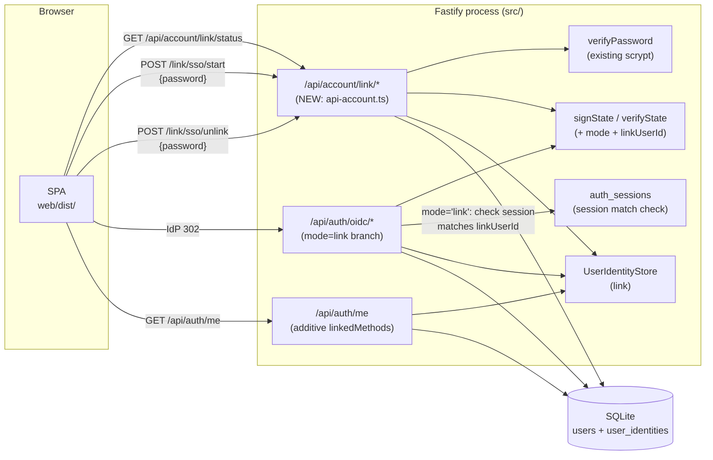

# Phase 07 — Design: Account linking

## Architecture overview



Touch surface, all additive:

| File | Change |
|---|---|
| `src/services/oidc.ts` | `OidcState` gains optional `mode` + `linkUserId`. `newLoginState(next, link?)` takes an optional 2nd arg. `verifyState` accepts the new fields as optional (no reject on extra keys). |
| `src/routes/api-auth-oidc.ts` | Callback branches on `stored.mode === 'link'` after the existing state/token/verify/group checks. Link branch verifies session matches `linkUserId`, calls `identities.link`, redirects to `/account?linked=ok` (no new session cookie). |
| `src/routes/api-account.ts` | **NEW.** Three routes: `GET /link/status`, `POST /link/sso/start`, `POST /link/sso/unlink`. |
| `src/routes/api-auth.ts` | `/api/auth/me` adds `linkedMethods: Array<'password'\|'oidc'>`. |
| `src/services/user-identity-store.ts` | `link()` is unchanged; callback adds a `forUser(userId, issuer, sub)` variant for clarity (or reuses `link` — see §"Ponytail notes"). |
| `web/src/routes/Account.tsx` | **NEW.** Linked-accounts panel + link/unlink forms. |
| `web/src/components/UserMenu.tsx` | Add "Account" `<Link>` to dropdown (above admin entries, available to all roles). |
| `web/src/App.tsx` | Register `/account` route guarded by `RouteGuard`. |
| `web/src/routes/Login.tsx` | Add 3 entries to `OIDC_ERROR_MESSAGES` (`link_session`, `link_already`, `link_conflict`). |
| `docs/architecture.md` | Phase 07 fold-in (per Step 7). |

No schema migration. No new dependencies. The `user_identities` table
already supports linking any `user_id`, password or OIDC.

## Module / package layout

`src/routes/api-account.ts` is the only new server file. It follows
the same shape as `api-auth-oidc.ts`:

```ts
export const accountRoutes: FastifyPluginAsync = async (fastify) => {
  const db = (fastify as unknown as { db: DB }).db;
  const users = new UserStore(db);
  const identities = new UserIdentityStore(db);
  const sessions = new AuthSessionStore(db);

  fastify.get('/api/account/link/status', /* ... */);
  fastify.post('/api/account/link/sso/start', /* ... */);
  fastify.post('/api/account/link/sso/unlink', /* ... */);
};
```

The SPA mirrors the same shape: `web/src/routes/Account.tsx` +
`UserMenu.tsx` line edit + `App.tsx` `<Route>` line.

## Data model

**No schema changes.** Existing tables suffice:

- `users.password_hash`: still `NOT NULL`. Password users keep their
  scrypt hash; OIDC users keep `'!oidc!'`. A linked password user
  has a real scrypt hash AND ≥ 1 `user_identities` row.
- `user_identities (issuer, sub) UNIQUE`: covers the (issuer, sub)
  → user mapping for both OIDC-provisioned and linked users.
- `user_identities.user_id ON DELETE CASCADE`: admin user delete
  cascades cleanly.

The semantic of `user_identities` row is widened: "this (issuer,
sub) is authenticated AS this local user" — true for both
OIDC-provisioned and linked-password users.

## API surface

### New: `GET /api/account/link/status` (auth required)

Response:

```jsonc
{
  "password": { "set": true },                              // false if sentinel hash
  "oidc": {
    "linked": true,
    "issuer": "https://keycloak.example.com/realms/foo",    // present iff linked
    "linkedAt": "2026-07-18 12:34:56"                        // ISO-ish, matches Phase 06 format
  }
}
```

Implementation: read `users.password_hash`, then
`SELECT issuer, created_at FROM user_identities WHERE user_id = ?
ORDER BY created_at ASC LIMIT 1`. The first row is enough — at most
one IdP per install, and Phase 07 doesn't introduce cross-IdP
linking.

### New: `POST /api/account/link/sso/start` (auth required)

Body: `{ password: string }`.

Server flow:
1. Resolve `request.user` (middleware already populates).
2. If `user.passwordHash === OIDC_PASSWORD_SENTINEL` → 400
   `{ error: 'Account has no password' }`.
3. If `identities.findByUserId(user.id)` returns any row → 409
   `{ error: 'Single sign-on already linked' }`.
4. `verifyPassword(password, user.passwordHash)` → if false, 401
   `{ error: 'Invalid password' }`.
5. If `loadOidcConfig()` returns null → 503
   `{ error: 'OIDC not configured' }`.
6. `newLoginState('/account', { mode: 'link', linkUserId: user.id })`
   → signs the state cookie (mode + linkUserId embedded).
7. Build the IdP authorize URL the same way
   `api-auth-oidc.ts:185` does (the discovery + authorize URL code
   is duplicated here — see §"Ponytail notes" for the refactor).
8. Set the `dockhoj_oidc` cookie (same helper as the existing route).
9. Return `{ location: '<idp authorize url>' }` (200). SPA does
   `window.location.assign(location)`.

Errors above use generic messages identical to existing flows; no
enumeration.

### New: `POST /api/account/link/sso/unlink` (auth required)

Body: `{ password: string }`.

Server flow:
1. Resolve `request.user`.
2. If `user.passwordHash === OIDC_PASSWORD_SENTINEL` → 400
   `{ error: 'Account has no password; cannot unlink the only login method' }`.
3. `verifyPassword(password, user.passwordHash)` → if false, 401.
4. `db.transaction(() => identities.unlinkAllForUser(user.id))`.
5. Return `{ linkedMethods: ['password'] }` (200).

### Modified: `GET /api/auth/me`

Existing payload gains `linkedMethods`:

```jsonc
{
  "id": "...",
  "username": "...",
  "role": "user",
  "linkedMethods": ["password"]       // or ["password", "oidc"]
}
```

Computed inline at the same place `request.user` is built
(`src/services/auth.ts:73`). One SELECT on `user_identities`.

### Modified: `GET /api/auth/oidc/callback`

After the existing state verify → token exchange → id_token verify
→ group check pipeline (no changes to any of those), branch:

```ts
const stored = verifyState(...);  // existing
// ... existing token exchange, verify, group check ...

if (stored.mode === 'link') {
  // Session-cookie must match linkUserId.
  const sid = parseCookieSid(request.headers.cookie);
  const session = sid ? sessions.findById(sid) : null;
  if (!session || session.userId !== stored.linkUserId) {
    log.warn({ event: 'oidc_link_session_missing' }, '...');
    return reply.redirect('/login?oidc_error=link_session');
  }
  const linkUserId = stored.linkUserId;

  // Already linked?
  const existing = identities.findByUserId(linkUserId);
  if (existing.length > 0) {
    return reply.redirect('/login?oidc_error=link_already');
  }

  // Race-safe insert.
  try {
    identities.link(linkUserId, cfg.issuer, String(payload.sub));
  } catch (e) {
    if (isUniqueConstraintError(e)) {
      const racerUserId = identities.findUserIdByIssuerSub(cfg.issuer, String(payload.sub));
      if (racerUserId === linkUserId) {
        // Same user re-linked — race win on our side.
        return reply.redirect('/account?linked=ok');
      }
      if (racerUserId) {
        // Different user already has this identity.
        return reply.redirect('/login?oidc_error=link_conflict');
      }
    }
    throw e;
  }

  log.info({ event: 'oidc_linked', userId: linkUserId, issuer: cfg.issuer, sub: payload.sub },
    'OIDC linked to existing user');
  return reply.redirect('/account?linked=ok');
}

// Existing login-mode path — UNCHANGED.
const user = await findOrCreateOidcUser(...);
const session = sessions.create(user.id);
// ... setSessionCookieHeader, redirect, log ...
```

Login-mode is structurally unchanged. The branch sits AFTER group
check (a denied user in link mode is still denied, no row created).

## Key algorithms / flows

### State-cookie format change (back-compat)

`OidcState` currently:

```ts
interface OidcState {
  state: string;
  nonce: string;
  verifier: string;
  next: string;
  exp: number;
}
```

After Phase 07:

```ts
interface OidcState {
  state: string;
  nonce: string;
  verifier: string;
  next: string;
  exp: number;
  mode?: 'login' | 'link';      // optional; default 'login' if absent
  linkUserId?: string;          // present iff mode === 'link'
}
```

`verifyState` (the existing validator) currently rejects on missing
required fields. It gains:

```ts
const mode = parsed.mode === 'link' || parsed.mode === 'login' ? parsed.mode : 'login';
const linkUserId = typeof parsed.linkUserId === 'string' && parsed.linkUserId.length > 0
  ? parsed.linkUserId : undefined;
if (mode === 'link' && !linkUserId) return null;  // malformed link cookie
return { ..., mode, linkUserId };
```

A cookie without `mode` decodes as `mode='login'` — Phase 06 cookies
in flight at upgrade time continue to work. The HMAC signature covers
the full JSON, so adding fields doesn't break verify.

### `newLoginState` gains an optional 2nd arg (ponytail)

Rather than a separate `newLinkState`, the existing helper takes an
optional link spec:

```ts
export function newLoginState(
  next: string,
  link?: { mode: 'link'; linkUserId: string },
): { state; nonce; verifier; challenge; stateObj } {
  // ... existing random bytes + challenge ...
  const stateObj: OidcState = link
    ? { state, nonce, verifier, next, exp: Date.now() + STATE_TTL_MS, mode: 'link', linkUserId: link.linkUserId }
    : { state, nonce, verifier, next, exp: Date.now() + STATE_TTL_MS };
  return { state, nonce, verifier, challenge, stateObj };
}
```

The 1-arg call shape is unchanged — every Phase 06 caller is a
no-op source-wise. `// ponytail: one helper, optional 2nd arg,
rather than a parallel newLinkState; the body has one extra branch`.

### IdP authorize URL construction (ponytail)

The IdP authorize URL build is currently inline in
`api-auth-oidc.ts:202-211` (5 lines: discovery + URL + 7
searchParams). The new `link/sso/start` route needs the same. The
ponytail-correct move is to extract a helper:

```ts
// In oidc.ts:
export async function buildAuthorizeUrl(
  cfg: OidcConfig,
  state: string, nonce: string, challenge: string,
): Promise<string> {
  const discovery = await getDiscovery(cfg);
  const url = new URL(discovery.authorization_endpoint);
  url.searchParams.set('response_type', 'code');
  url.searchParams.set('client_id', cfg.clientId);
  url.searchParams.set('redirect_uri', cfg.redirectUri);
  url.searchParams.set('scope', cfg.scopes);
  url.searchParams.set('state', state);
  url.searchParams.set('nonce', nonce);
  url.searchParams.set('code_challenge', challenge);
  url.searchParams.set('code_challenge_method', 'S256');
  return url.toString();
}
```

Both routes call it. This is a refactor of Phase 06 code that
Phase 07 forces (a new caller makes the duplication visible).
The diff to Phase 06 is a function moved into `oidc.ts` and one
call-site in `api-auth-oidc.ts:202-211` replaced — no behavior
change.

### Password re-auth defense (NFR-2)

Both `/start` and `/unlink` require `verifyPassword(password,
user.passwordHash)` — the existing scrypt path. A stolen browser
session without the password cannot bind or unbind SSO. The
constant-time comparison comes from the existing
`password.ts:verifyPassword` (no new code).

For an OIDC-provisioned user (sentinel hash), the sentinel-reject
in `verifyPassword` happens before the comparison — same as Phase 06.
We surface a 400 (not 401) on `link/sso/start` and `link/sso/unlink`
when the hash is sentinel, because "wrong password" is misleading
when there's no password to be wrong about.

### Session match at link callback (NFR-3 / FR-7)

The link callback requires the current session cookie's
`auth_sessions.user_id` to equal `stored.linkUserId`. This binds
the IdP identity to the user who initiated the link. The check
sits AFTER state verify + id_token verify + group check — so a
denied / tampered / forged request never gets far enough to touch
the session table.

`parseCookieSid` and `sessions.findById` already exist (auth.ts +
auth-session-store.ts). No new code.

### SPA `/account` (FR-13 / FR-14)

```tsx
// web/src/routes/Account.tsx (sketch)
export function Account() {
  const { user, refresh } = useAuth();
  const [location] = useLocation();
  const query = new URLSearchParams(location.split('?')[1] ?? '');
  const success = query.get('linked') === 'ok';

  const [status, setStatus] = useState<LinkStatus | null>(null);
  const [busy, setBusy] = useState(false);
  const [error, setError] = useState<string | null>(null);
  const [showLinkForm, setShowLinkForm] = useState(false);
  const [showUnlinkForm, setShowUnlinkForm] = useState(false);
  const [password, setPassword] = useState('');

  useEffect(() => {
    fetch('/api/account/link/status', { credentials: 'include' })
      .then((r) => (r.ok ? r.json() : null))
      .then(setStatus);
  }, []);

  async function onLinkSubmit(e: Event) {
    e.preventDefault();
    setBusy(true); setError(null);
    try {
      const res = await fetch('/api/account/link/sso/start', {
        method: 'POST',
        credentials: 'include',
        headers: { 'Content-Type': 'application/json' },
        body: JSON.stringify({ password }),
      });
      if (!res.ok) {
        const j = await res.json().catch(() => ({}));
        setError(j.error ?? 'Failed to start link');
        return;
      }
      const { location } = await res.json();
      window.location.assign(location);  // full-page nav to IdP
    } finally {
      setBusy(false);
    }
  }

  async function onUnlinkSubmit(e: Event) {
    e.preventDefault();
    setBusy(true); setError(null);
    try {
      const res = await fetch('/api/account/link/sso/unlink', {
        method: 'POST',
        credentials: 'include',
        headers: { 'Content-Type': 'application/json' },
        body: JSON.stringify({ password }),
      });
      if (!res.ok) {
        const j = await res.json().catch(() => ({}));
        setError(j.error ?? 'Failed to unlink');
        return;
      }
      await refresh();        // pull new linkedMethods
      setStatus((s) => s && { ...s, oidc: { linked: false } });
      setPassword('');
    } finally {
      setBusy(false);
    }
  }

  if (!user) return null;  // RouteGuard handles the redirect, but be safe
  if (!status) return <div class="route-loading">Loading…</div>;

  return (
    <div class="account-page">
      <h1>Account</h1>
      {success && <div class="account-banner">Single sign-on linked.</div>}

      <section class="account-panel">
        <h2>Profile</h2>
        <dl>
          <dt>Username</dt><dd>{user.username}</dd>
          <dt>Role</dt><dd>{user.role}</dd>
        </dl>
      </section>

      <section class="account-panel">
        <h2>Linked accounts</h2>
        <ul>
          <li>
            <strong>Password:</strong> {status.password.set ? '✓ set' : '✗ not set'}
          </li>
          <li>
            <strong>Single sign-on:</strong>{' '}
            {status.oidc.linked
              ? `✓ linked to ${status.oidc.issuer}`
              : '✗ not linked'}
            {/* Render link/unlink forms only when meaningful. */}
          </li>
        </ul>

        {error && <div class="account-error">{error}</div>}

        {/* Link form: only for password users without an SSO link. */}
        {!status.oidc.linked && status.password.set && (
          showLinkForm ? (
            <form onSubmit={onLinkSubmit}>
              <label>
                Confirm your password to link single sign-on
                <input
                  type="password"
                  autoComplete="current-password"
                  required
                  value={password}
                  onInput={(e) => setPassword((e.currentTarget as HTMLInputElement).value)}
                />
              </label>
              <button type="submit" disabled={busy}>
                {busy ? 'Continuing…' : 'Continue to single sign-on'}
              </button>
              <button type="button" onClick={() => { setShowLinkForm(false); setPassword(''); setError(null); }}>
                Cancel
              </button>
            </form>
          ) : (
            <button type="button" onClick={() => setShowLinkForm(true)}>
              Link single sign-on
            </button>
          )
        )}

        {/* Unlink form: only for users with both password and SSO. */}
        {status.oidc.linked && status.password.set && (
          showUnlinkForm ? (
            <form onSubmit={onUnlinkSubmit}>
              <label>
                Confirm your password to unlink single sign-on
                <input
                  type="password"
                  autoComplete="current-password"
                  required
                  value={password}
                  onInput={(e) => setPassword((e.currentTarget as HTMLInputElement).value)}
                />
              </label>
              <button type="submit" disabled={busy}>
                {busy ? 'Unlinking…' : 'Unlink single sign-on'}
              </button>
              <button type="button" onClick={() => { setShowUnlinkForm(false); setPassword(''); setError(null); }}>
                Cancel
              </button>
            </form>
          ) : (
            <button type="button" onClick={() => setShowUnlinkForm(true)}>
              Unlink single sign-on
            </button>
          )
        )}
      </section>
    </div>
  );
}
```

Inline forms (not a modal lib) — matches the rest of the SPA. No
"Change password" panel (OOS-4; requirements.md has this as a
"panel renders the form but POST is out of scope" carve-out —
**dropping that here**: a form with no handler is worse UX than no
form. The /account page is JUST profile + linked accounts in this
phase).

### UserMenu addition (FR-14)

```tsx
<Link href="/account" class="user-menu-item" role="menuitem" onClick={() => setOpen(false)}>
  Account
</Link>
```

Inserted ABOVE the admin entries, available to all roles. Logout
stays at the bottom.

### Login error mapping (FR-16..18)

Three additions to `OIDC_ERROR_MESSAGES` in `web/src/routes/Login.tsx`:

```ts
link_session: 'Your session expired before the link completed. Sign in again and try again.',
link_already: 'Single sign-on is already linked to your account.',
link_conflict: 'That identity is already linked to another account. Contact your administrator.',
```

## State management

No server-side state changes for the link flow. The state cookie
carries `mode` + `linkUserId`; the session cookie carries `user_id`.
The link callback reads both, matches, inserts one `user_identities`
row. No transactions spanning tables (the `(issuer, sub)` UNIQUE is
the race guard).

## Error handling strategy

See §"API surface" for each endpoint's error map. Identical-message
rule (architecture.md §"Auth") honored: `/start` 401 is `Invalid
password`, no distinction between "no such user" and "wrong
password" (the user comes from the session cookie, so "no such user"
isn't possible — but the 401 message stays generic for consistency).

Callback error codes:

| Failure | Redirect |
|---|---|
| state invalid / expired | `/login?oidc_error=state` (existing) |
| token exchange | `/login?oidc_error=exchange` (existing) |
| id_token verify | `/login?oidc_error=token` (existing) |
| group denied | `/login?oidc_error=denied` (existing) |
| **link: no session / session mismatch** | `/login?oidc_error=link_session` (NEW) |
| **link: already linked** | `/login?oidc_error=link_already` (NEW) |
| **link: identity belongs to other user** | `/login?oidc_error=link_conflict` (NEW) |
| login mode happy | `/chat` (existing) |
| link mode happy | `/account?linked=ok` (NEW) |

## Testing strategy

Per project CLAUDE.md §2.0: `./restart.sh` + curl is the primary
signal. Vitest covers the server logic that curl can't easily
exercise (state-cookie mode round-trip, conflict detection).

**Vitest additions:**

- `tests/services/oidc-state.test.ts`: extend with `mode='link'`
  and `mode=undefined` round-trips; verify Phase 06 cookies (no
  mode) still decode as `mode='login'`.
- `tests/routes/api-account.test.ts` (NEW):
  - `GET /link/status` — password set true + oidc linked false / true
  - `POST /link/sso/start` — happy path sets state cookie, body
    `location` is the IdP authorize URL
  - `POST /link/sso/start` — 401 on bad password
  - `POST /link/sso/start` — 409 if user already linked
  - `POST /link/sso/start` — 400 if user is sentinel
  - `POST /link/sso/start` — 503 if OIDC not configured
  - `POST /link/sso/unlink` — happy path deletes identity row
  - `POST /link/sso/unlink` — 400 if sentinel
  - `POST /link/sso/unlink` — 401 on bad password
- `tests/routes/api-auth-oidc.test.ts`: extend with link-mode cases
  - `mode='link'` happy path → `/account?linked=ok`, identity row
    inserted, NO new session cookie
  - `mode='link'` no session → `/login?oidc_error=link_session`
  - `mode='link'` session mismatch (cookie user ≠ linkUserId) →
    `/login?oidc_error=link_session`
  - `mode='link'` user already has identity row →
    `/login?oidc_error=link_already`
  - `mode='link'` (issuer, sub) belongs to different user →
    `/login?oidc_error=link_conflict`
  - `mode='link'` race — two concurrent callbacks with same
    (issuer, sub) and same linkUserId → first wins, second sees
    existing row pointing at linkUserId → `/account?linked=ok`
  - login mode unchanged: existing tests still pass
- `tests/routes/api-auth.test.ts`: `/me` returns `linkedMethods`
  field, correct values for password-only / oidc-only / linked
  user

**E2E walkthrough** (in fold-in commit):

1. `./restart.sh` — fresh stack with OIDC configured.
2. Register password user `alice` via `/register`.
3. Sign in as alice (POST `/api/auth/login`).
4. POST `/api/account/link/sso/start` with alice's password →
   expect `{ location: '<idp url>' }`.
5. (IdP redirect + callback — covered by vitest.)
6. Sign out; sign in via `/api/auth/oidc/login` (the existing
   button). Expect a valid session.
7. Sign out; sign in via `/api/auth/login` with alice's password.
   Expect a valid session.
8. Sign in as alice. GET `/api/auth/me` → expect
   `linkedMethods: ['password', 'oidc']`.
9. POST `/api/account/link/sso/unlink` with alice's password.
   GET `/api/account/link/status` → expect `oidc.linked: false`.
10. POST `/api/account/link/sso/start` again — expect 409.

## Deployment / runtime

No env var changes. No new dependencies. No schema migration. The
`OIDC_*` env vars from Phase 06 are the only OIDC surface.

## Security & privacy

- **Password re-auth (NFR-2).** Both endpoints require
  `verifyPassword` against the current user's stored hash. Stolen
  browser session ≠ bind/unbind.
- **Session match (FR-7).** Link callback verifies the session's
  user_id equals the state cookie's linkUserId. The state cookie is
  HMAC-signed (Phase 06) so linkUserId is tamper-proof.
- **Existing OIDC checks unchanged.** PKCE S256, state, nonce, iss,
  aud, exp, jwks — all preserved in the link branch.
- **Group gate still applies.** A user who's been kicked from the
  IdP group can't complete a link — `extractGroups` +
  `isMember(allowedGroups)` runs before the link branch.
- **No new logging surface.** INFO logs use the existing shape:
  `{ event, userId, username, issuer, sub }`.
- **No new PII.** Password hash stays where it is; identity rows
  carry the same `(issuer, sub)` as Phase 06.

## Risks

1. **IdP changes `sub` (rare).** New `(issuer, newSub)` row gets
   inserted for the same user. They'd have multiple identity rows;
   unlink deletes all of them. Acceptable; per-row management is
   future work.
2. **Orphan identity rows after operator disables OIDC.** Harmless
   (no code path reads them when `OIDC_ENABLED=false`). Operator
   can `DELETE FROM user_identities WHERE issuer='<old>'` to clean.
3. **Re-link race.** Two concurrent link attempts with the same
   `(issuer, sub)` hit the UNIQUE constraint. The second callback
   sees the row already points at the right user → success
   redirect. See NFR-3.
4. **Stolen password + browser.** An attacker who has both can
   link/unlink SSO. This is "having the password means having the
   account," which is the existing security model.

## Implementation order

```mermaid
gantt
    title Phase 07 task graph
    dateFormat X
    axisFormat %s

    section Server
    T01 oidc state format :a1, 0, 1
    T02 callback link branch :a2, after a1, 1
    T03 /api/account/* routes :a3, after a1, 1
    T04 /me linkedMethods :a4, after a1, 1

    section SPA
    T05 UserMenu + /account route :b1, after a3, 1
    T06 Account.tsx + Login errors :b2, after a3, 1

    section Verify
    T07 E2E walkthrough :c1, after b1 b2, 1
    T08 docs fold-in :c2, after c1, 1
```



| Gate | Parallel tasks |
|---|---|
| After **T01** | `T02` (api-auth-oidc.ts) ∥ `T03` (new api-account.ts) ∥ `T04` (api-auth.ts) |
| After **T02..T04** | `T05` (UserMenu + App.tsx) ∥ `T06` (Account.tsx + Login.tsx) |
| After **T05+T06** | `T07` (E2E walkthrough) ∥ `T08` (docs fold-in) |

**Critical path:** T01 → T03 → T06 → T07 → T08.

## Ponytail notes

These are the deliberate shortcuts baked into the design. Each is
justified; the upgrade path is named so a future change knows where
to start.

- **`newLoginState` takes an optional 2nd arg instead of a parallel
  `newLinkState` helper.** One function, one extra branch. Upgrade:
  if Phase 8+ adds a third mode, consider splitting — until then
  the 1-arg callers see no source change.
- **`buildAuthorizeUrl` extracted during Phase 07 (not in Phase 06).**
  Phase 06 had one caller; one duplicate isn't worth abstracting.
  Phase 07 introduces a second caller (`link/sso/start`), which
  crosses the YAGNI line. The refactor is mechanically a move into
  `oidc.ts` + one call-site rewrite in `api-auth-oidc.ts`.
- **`/link/status` returns at most one identity row.** The
  `LIMIT 1` is hard-coded; multi-IdP support (OOS-3) would lift
  this. Today: one IdP per install, one identity row per user —
  the LIMIT 1 is correct.
- **`unlink` deletes ALL identity rows for the user, not a single
  one.** No UI to pick a single identity today (one IdP per
  install). Upgrade when per-row management becomes real.
- **No `link_events` audit table.** INFO logs are the record.
  Upgrade when an operator asks for an in-app audit log (likely
  never for a self-hosted tool).
- **No email column.** OOS-1; auto-link requires email. If asked,
  it's a separate phase: migration 009 + matching logic + threat
  model review.

## Requirements adjustments flagged here

- **FR-13 in requirements.md mentions a "Change password" panel.**
  **Dropping it.** A form with no working handler is worse UX than
  no form. `POST /api/account/password` is its own workstream.
  The /account page is JUST profile + linked accounts. Confirm
  at design review or push back.
- **US-1 step 4 / US-4 step 3 explicitly require password re-auth.**
  Carried through to NFR-2 and the design. Working assumption from
  OQ-1.
- **OQ-2 (recompute role for linked users) is YES by default.**
  `updateRoleIfChanged` runs in `findOrCreateOidcUser`; that path
  is unchanged. Linked users who log in via SSO get their role
  recomputed. This matches the existing behavior for OIDC-provisioned
  users and keeps IdP as the source of truth.